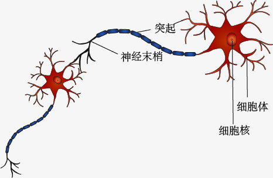

# Chapter 1

[TOC]


## 一、全连接神经网络

### 1、神经元




通过对人脑神经细胞的研究后，一个神经元有一条轴突和若干的树突，即多个输入，一个输出。

图中，n维向量：[a1,a2,a3,…,an]的输入，[w1,w2,w3,…,wn]为输入分量连接到感知机的权重(weight)，b为偏置，f(sum)为激活函数，t为该神经元的输出。其数学表达式为：
$$
sum=a_{1}w_{1}+a_{2}w_{2}+a_{3}w_{3}+...+a_{n}w_{n}+b
$$

$$
t = f(x)
$$

写作矩阵的形式为：
$$
sum = \begin{bmatrix}
a_{1} &a_{2}  &a_{3} &...  & a_{n}
\end{bmatrix}*\begin{bmatrix}
w_{1}\\ 
w_{2}\\ 
w_{3}\\ 
...\\ 
w_{n}
\end{bmatrix}+\begin{bmatrix}
b
\end{bmatrix}
$$

$$
t = f(A^{T}W+B)
$$


### 2、激活函数

激活函数可以为神经元提供非线性能力，如果没有非线性的激活函数，只是将众多的线性神经元叠加，只会得到由众多的w参数和b参数控制的一条直线：
$$
y=(w_{n}...(w_{3}(w_{2}(w_{1}x+b_{1})+b_{2})+b_{3})+...+b_{n})
$$


下面是几种常见的激活函数：

#### 1）sigmoid函数

表达式为：
$$
sigmoid(z)=\frac{1}{1+e^{-z}}
$$


sigmoid函数的值域为(0,1)。从图中可知，当因变量取值为零时，sigmoid曲线的斜率最大，为0.25。当其取值越大或是越小时，则斜率(梯度)就越小。如果z取值过大，那么参数的更新速度就可能会变得非常缓慢。

#### 2）tanh函数

$$
tanh(z)=\frac{e^{z}-e^{-z}}{e^{z}+e^{-z}}
$$


如果选择 tanh 作为隐藏层的激活函数，效果几乎总是比 sigmoid 函数要好，因为 tanh 函数的输出介于 -1 与 1 之间，激活函数的平均值就更接近于 0，而不是 0.5，这让下一层的学习更加方便一点。

和 sigmoid 函数类似，当因变量 zzz 取值为 0 时，tanh 曲线的斜率（梯度）最大，计算出来为 1。当因变量 zzz 的取值越大或越小时，sigmoid 曲线的斜率（梯度）就越小。所以 tanh 也会面临和 sigmiod 函数同样的问题：当 zzz 很大或很小时，tanh 曲线的斜率（梯度）几乎为零，这对于执行梯度下降算法十分不利。

#### 3）ReLU函数

$$
ReLU(z)=max(0,x)
$$


ReLU (Rectified Linear Unit)，即修正线性单元。现在 ReLU 已经成为了隐层激活函数的默认选择。如果不确定隐层应该使用哪个激活函数，可以先尝试一下 ReLU。

当 z > 0 时，曲线斜率为 1；当 z < 0 时，曲线的斜率为 0；当 z = 0 时，曲线不可导，斜率就失去了意义，但在实际编程的时候可以令其为 1 或 0，尽管在数学上这样不正确，但不必担心，因为出现 z = 0 的概率非常非常小。ReLu函数的好处在于对于大部分的 z，激活函数的斜率（导数）和 0 差很远。所以在隐层中使用 ReLU 激活函数，神经网络的学习速度通常会快很多。ReLU 也有一个缺点，那就是当 z 为负数时，ReLU 曲线的斜率为 0，不过这在实践中不会有什么问题，因为有足够多的隐层节点使 z 大于 0。

#### 4）LeakyReLU函数

$$
ReLU(z)=max(kz,x)，k=0.1
$$


#### 5）ELU函数

$$
ELU(z)=\left\{\begin{matrix}
z & x\geq 0\\ 
\sigma (e^{z}-1) & x<0
\end{matrix}\right.
$$


### 3、深度神经网络与深度学习


- 多个神经元构成一层神经网络，然后神经网络按一层一层构建，就构成了深度神经网络
- 网络由输入层，隐藏层，输出层构成
- 深度神经网络的学习过程被称为深度学习


### 4、输出函数

激活函数是使用在隐藏层之间的，主要是为了给网络提供非线性能力

输出函数的作用是为了限制输出的值域。

线性输出函数：
$$
linear(x)=x
$$


sigmoid函数将输出限制在（0,1）之间，多用于两分类：

$$
sigmoid(z)=\frac{1}{1+e^{-z}}
$$


softmax函数，用于多分类，也叫归一化指数函数：

$$
softmax(x_{i})=\frac{e^{x_{i}}}{\sum_{j}^{}e^{x_{j}}}
$$


### 5、pytorch中读取转化数据

使用pytorch的torch.utils.data.Dataset处理自己的数据集。

创建一个类，继承于Dataset。，

其中，只重载`__init__`函数、`__len__` 函数、`__getitem__`函数

示例：

```python
class MNISTDataset(Dataset):
    '''只重载  __init__函数
              __len__ 函数
              __getitem__函数'''

    def __init__(self,is_train=True):
        '''初始化数据集(将数据集读取进来)'''
        '''一般由于数据过大，只将数据存储的路径读取进来'''	
        
        print("init")
        pass

    def __len__(self):
        '''统计数据的个数'''
        print('len')
        return 2
        pass

    def __getitem__(self, index):
        '''每条数据的处理方式'''
        print(index)
        pass
```

其中`__init__`函数在实例化对象时执行，`__len__` 函数在调用len()时执行，而`__getitem__`则在索引时执行

以下调用函数：

```python
mnist_dataset = MNISTDataset()#实例化对象
print(len(mnist_dataset))
mnist_dataset[1]
```

输出结果：

```python
init
len
2
1
```


读取手写数字的代码

```python
'''使用pytorch处理自己的数据集'''
from torch.utils.data import Dataset
import os
import cv2
import numpy
'''创建自己的数据集'''

"""
Data 模块
"""
class MNISTDataset(Dataset):
    '''只重载  __init__函数
              __len__ 函数
              __getitem__函数'''

    def __init__(self,root,is_train=True):
        '''初始化数据集(将数据集读取进来)'''
        '''一般由于数据过大，只将数据存储的路径读取进来'''

        self.root = root#文件的父路径
        self.dataset = []#记录所有数据

        '''根据is_train选择加载的数据集'''
        sub_dir = "TRAIN" if is_train else "TEST"
        for tag in os.listdir(f'{root}/{sub_dir}'):
            img_dir = f"{self.root}/{sub_dir}/{tag}"
            for img_filename in os.listdir(img_dir):
                img_path = f"{img_dir}/{img_filename}"

                """封装成数据集,img_path为数据的路径，而后一个为标签"""
                self.dataset.append((img_path,int(tag)))
        pass

    def __len__(self):
        '''统计数据的个数'''

        pass
        '''返回数据集的长度'''
        return len(self.dataset)

    def __getitem__(self, index):
        '''每条数据的处理方式'''

        pass

        data = self.dataset[index]
        
        '''opencv以灰度图的形式读取图片为numpy的格式'''
        image_data = cv2.imread(data[0],cv2.IMREAD_GRAYSCALE)

        '''调整数据形状'''
        image_data = image_data.reshape(-1)

        '''数据的归一化'''
        image_data = image_data/255

        """one-hot编码"""
        target = numpy.zeros(10)
        target[data[1]] = 1

        return image_data,target


if __name__ == '__main__':
    dataset = MNISTDataset('D:/data/MNIST_IMG')
    print(dataset[1])
```

调试结果：

```python
(array([0.        , 0.        , 0.        , 0.        , 0.        ,
       0.        , 0.        , 0.        , 0.        , 0.00392157,
       0.        , 0.        , 0.        , 0.00784314, 0.        ,
       0.00784314, 0.        , 0.00784314, 0.        , 0.        ,
       0.00784314, 0.        , 0.        , 0.00784314, 0.        ,
       0.        , 0.        , 0.        , 0.        , 0.        ,
       0.        , 0.        , 0.        , 0.        , 0.        ,
       0.        , 0.00392157, 0.00784314, 0.        , 0.00784314,
       0.00392157, 0.        , 0.        , 0.        , 0.        ,
       0.        , 0.        , 0.        , 0.00784314, 0.        ,
       0.00392157, 0.        , 0.        , 0.        , 0.        ,
       0.        , 0.        , 0.        , 0.        , 0.        ,
       0.        , 0.        , 0.        , 0.        , 0.        ,
		..................
       0.        , 0.        , 0.        , 0.        ]), array([1., 0., 0., 0., 0., 0., 0., 0., 0., 0.]))
```

完成数据的读取。


### 6、构建神经网络

使用pytorch构建一个网络模型：

- 首先创建一个网络模型类，该类需继承于`torch.nn.Module`
- 接下来定义该模型初始化时的模型参数，这里定义一个三层的神经网络。
- 第一层为输入层，神经元需要接收784维度的数据，暂定为1024个神经元，故该层矩阵形状为784X1024
- 第二层为隐藏层，需要接收的数据为上一层输出的数据维度，设定改层有512个神经元，故该层矩阵形状为1024X512。
- 前两层激活函数采用sigmoid函数
- 第三层为输出层，需要接收的数据为上一层输出的数据，因为需要识别十个手写数字，故输出的个数为10，即10个神经元。故该层的矩阵形状为512X10.
- 定义完成模型参数后，需重写从父类继承来的`forward()`方法，如不则会抛出异常。
- 定义模型的前向计算过程

代码示例：

```python
import torch
class Net_v1(torch.nn.Module):

    def __init__(self):
        super(Net_v1, self).__init__()
        
        '''模型参数的定义'''
        self.w1 = torch.nn.Parameter(torch.randn(784,1024))
        self.b1 = torch.nn.Parameter(torch.randn(1024))
        self.w2 = torch.nn.Parameter(torch.randn(1024,512))
        self.b2 = torch.nn.Parameter(torch.randn(512))
        self.w3 = torch.nn.Parameter(torch.randn(512, 10))
        self.b3 = torch.nn.Parameter(torch.randn(10))

    def forward(self,x):
        '''网络前向过程'''
        
        '''矩阵乘法，即XW+B'''
        x = x @ self.w1 +self.b1
        
        '''通过sigmoid函数激活'''
        x = torch.sigmoid(x)
        x = x @ self.w2 + self.b2
        x = torch.sigmoid(x)
        x = x @ self.w3 +self.b3

        '''Softmax'''
        h = torch.exp(x)

        '''对每一个批次的求和，故dim=1，同时需要保持维度不变，keepdim传入参数True'''
        z = torch.sum(h,dim=1,keepdim=True)
        return h/z
```

测试所写的网络模型类：

```python
if __name__ == '__main__':
        net = Net_v1()# 实例化网络模型
    x = torch.randn(3,784)# 假定一个输入数据，该数据有三个批次，每个批次，具有784个维度的数值
    print(net(x)) # 打印网络的输出
    print(net(x).shape) # 打印网络模型输出的形状
```

运行结果：

```python
tensor([[2.8987e-17, 1.0238e-07, 7.4177e-07, 3.3368e-11, 3.6773e-06, 2.2438e-09,
         1.4206e-10, 1.0000e+00, 1.6601e-14, 1.1358e-17],
        [6.0002e-22, 3.7484e-01, 1.4154e-02, 4.3087e-10, 6.0854e-01, 1.9784e-06,
         2.4641e-03, 1.8749e-07, 1.2815e-13, 4.5551e-16],
        [1.5913e-11, 1.3466e-05, 7.3821e-01, 8.4785e-11, 1.0779e-05, 1.2743e-02,
         2.4902e-01, 2.2087e-09, 4.8927e-06, 8.6958e-14]],
       grad_fn=<DivBackward0>)
torch.Size([3, 10])
```

测试结果，网络模型的程序编写正确。


### 7、网络模型的训练

#### （1）训练：

网络模型的训练，需要编写一个训练类。

新导入库文件，`torch.utils.data.DataLoader`以用来，加载我们所编写的Dataset类。

`tqdm`库，用来显示训练当中一次遍历样本的一个进度。

首先是编写初始化函数：

1. 实例化所编写的数据读取MNISTDataset类。
2. 将实例化的MNISTDataset类传入`DataLoader`,实例出一个数据加载器`train_dataloader`，同时在此定义一次训练的数据批次，和是否打乱。
3. 实例化模型
4. 创建优化器

然后编写call函数，再此编写训练程序，以便直接调用。

```python
from torch.utils.data import DataLoader
import tqdm
class Train:

    def __init__(self,root):
        '''训练集对象'''
        self.train_dataset = MNISTDataset(root)

        '''实例化数据加载器'''
        self.train_dataloader = DataLoader(self.train_dataset, batch_size=100, shuffle=True)

        '''创建模型'''
        self.net = Net_v1()

        '''创建Adam优化器'''
        self.optim = torch.optim.Adam(self.net.parameters())

    def __call__(self):
        for epoch in range(10000000):
            for img, taget in tqdm.tqdm(self.train_dataloader):
                out = self.net(img)

                '''定义一个损失函数，此为均方差'''
                loss = torch.mean((taget-out)**2)

                '''训练过程'''
                self.optim.zero_grad()# 梯度归零
                loss.backward()# 自动求导
                self.optim.step()# 梯度更新
```

运行：

```python
if __name__ == '__main__':
    train = Train('D:/data/MNIST_IMG')
    train()
```

此时会报出类型错误：

```python
RuntimeError: Expected object of scalar type Double but got scalar type Float for argument #3 'mat2' in call to _th_addmm_out
```


原因是在我们编写`MNISTDataset`类的时候，`__getitem__`函数返回的是numpy类型的数据。只需将其改写为：

```python
class MNISTDataset(Dataset):
	def __init__(self, root, is_train=True):
        '''...'''
    def __len__(self): 
        '''...'''
    def __getitem__(self, index):
        '''...'''
		return torch.tensor(image_data,dtype=torch.float32), torch.tensor(target,dtype=torch.float32)
```


在创建模型参数时，参数默认的位Float32的数据类型。32位的数据精度足够。

再此运行程序：

```python
  1%|          | 5/600 [00:07<14:23,  1.45s/it]
```

已正常训练。


#### （2）验证：

实例化出验证集对象，和验证集数据加载器，验证。

```python
class Train:

    def __init__(self, root):
        '''训练集对象'''
        self.train_dataset = MNISTDataset(root)
        self.test_dataset = MNISTDataset(root, False)
        '''实例化数据加载器'''
        self.train_dataloader = DataLoader(self.train_dataset, batch_size=100, shuffle=True, num_workers=4)
        self.test_dataloader = DataLoader(self.test_dataset, 100, False, num_workers=4)
		'''...'''
    def __call__(self):

        for epoch in range(10000000):
            
            '''...'''
            
            '''验证'''
            score = 0
            test_loss = 0
            for img, taget in tqdm.tqdm(self.test_dataloader):
                out = self.net(img)
                loss = torch.mean((taget - out) ** 2)
                pre_tage = torch.argmax(out,1)
                taget_tage = torch.argmax(taget,1)
                score += torch.sum(torch.eq(pre_tage,taget_tage).float())
                test_loss += loss.item()
            test_avg_loss = test_loss / len(self.test_dataloader)
            score = score/len(self.test_dataloader)
            print('轮次:', epoch, '训练损失:', ave_loss, '验证损失:', test_avg_loss,'准确度得分:',score)
```

结果：

```python
轮次: 0 训练损失: 0.06720203060656786 验证损失: 0.03979699391056783 准确度得分: tensor(77.5100)
轮次: 1 训练损失: 0.0360484298504889 验证损失: 0.033634464353672226 准确度得分: tensor(80.8700)
轮次: 2 训练损失: 0.031092832915795347 验证损失: 0.031602507726929616 准确度得分: tensor(82.1900)
```

#### （3）训练中的数据图形化

##### tensorboard

控制台中使用`pip install tensorboard`安装tensorboard模块。

导入tensorboard模块中的SummaryWriter：

```python
from torch.utils.tensorboard import SummaryWriter
```

使用时，仅需将SummaryWriter类，实例化出来，实例化时需要传入参数，即该日志文件保存的位置。调用`add_scalars()`方法，添加多个变量；以及调用`add_scalar()`方法，添加单个变量。


`add_scalars()`方法

```方法
add_scalars(self, main_tag, tag_scalar_dict, global_step=None, walltime=None)
```

需要传入的参数为

|      参数       |            描述            |
| :-------------: | :------------------------: |
|    main_tag     |          主要名称          |
| tag_scalar_dict | 字典类型的数据，名称：数值 |
|   global_step   |         每几步计数         |


实例化SummaryWriter对象时，选择将日志文件保存于'D:/data/chapter1/logs'。同时分别调用`add_scalars()`方法和`add_scalar()`方法保存数据。

```python
class Train:

    def __init__(self, root):

        '''实例化SummaryWriter对象'''
        self.summar_writer = SummaryWriter('D:/data/chapter1/logs')
        '''...'''

    def __call__(self):

        '''...'''
            self.summar_writer.add_scalars("loss",{'train_loss':ave_loss,'test_loss':test_avg_loss},epoch)
            self.summar_writer.add_scalar("score",score,epoch)
```


查看说绘制的图：

通过控制台进入日志文件保存路径'D:/data/chapter1/logs'的上一级地址：

'D:/data/chapter1'使用命令`tensorboard --logdir=logs`即可

显示：

```python
TensorFlow installation not found - running with reduced feature set.
Serving TensorBoard on localhost; to expose to the network, use a proxy or pass --bind_all
TensorBoard 2.2.2 at http://localhost:6006/ (Press CTRL+C to quit)
```

复制`http://localhost:6006/`预览器中打开，即可。可观察到如下两幅图片。


#### （4）网络模型参数的保存和加载“

`torch.save(net.state_dict(),path)`:

功能：保存训练完的网络的各层参数（即weights和bias)

其中：net.state_dict()获取各层参数，path是文件存放路径(通常保存文件格式为.pt或.pth)

`net.load_state_dict(torch.load(path))`:

功能：加载保存到path中的各层参数到神经网络


#### （5）模型的打包

使用到torch中的jit模块,将模型打包，以便于能部署于其他地方，或是由其他程序调用。

```python
from torch import jit
```

示例：

```python
model = Net_v1()

'''虚拟一个输入，占位用的'''
x = torch.randn(1,784)
torch_model = jit.trace(model,x)
torch_model.save("minist_net.pt")
```

然后生成文件：


如此可在以后使用它


#### （6）C++的调用

进入pytorch官网：


下载pytorch的C++包

解压至本地

配置CMakeLists文件：

```c++
cmake_minimum_required(VERSION 3.14)//cmake的版本
project(deeplearn)//项目名

set(CMAKE_PREFIX_PATH D:/lib/libtorch-win-shared-with-deps-1.5.1+cpu/libtorch)//设置安装包的位置，这里为pytorch的文件位置
set(OpenCV_DIR D:/opencv/build/x64/vc15/lib)//opencv的文件路径

find_package(Torch REQUIRED)
find_package(OpenCV REQUIRED)
set(CMAKE_CXX_FLAGS "${CMAKE_CXX_FLAGS} ${TORCH_CXX_FLAGS}")


add_executable(deeplearn  main.cpp)
target_link_libraries(deeplearn ${TORCH_LIBRARIES} ${OpenCV_LIBS})
set_property(TARGET deeplearn PROPERTY CXX_STANDARD 11)

if (MSVC)
    file(GLOB TORCH_DLLS "${TORCH_INSTALL_PREFIX}/lib/*.dll")
    add_custom_command(TARGET deeplearn
            POST_BUILD
            COMMAND ${CMAKE_COMMAND} -E copy_if_different
            ${TORCH_DLLS}
            $<TARGET_FILE_DIR:deeplearn>)

    file(GLOB OPENCV_DLLS "D:/opencv/build/x64/vc15/bin/*.dll")
    add_custom_command(TARGET deeplearn
            POST_BUILD
            COMMAND ${CMAKE_COMMAND} -E copy_if_different
            ${OPENCV_DLLS}
            $<TARGET_FILE_DIR:deeplearn>)
endif (MSVC)
```

编写C++的代码：

```c++
#include <iostream>
#include <torch/torch.h>
#include <torch/script.h>
#include<opencv2/opencv.hpp>
#include <vector>
#include <string>

int main() {
    try {
        //读取图片
        cv::Mat image = cv::imread("7.jpg", cv::IMREAD_GRAYSCALE);

        //图片数据转换为tensor数据，并把数据转换为float
        torch::Tensor tensor_image = torch::from_blob(image.data, {1, image.rows * image.cols}, torch::kByte).toType(
                torch::kFloat);

        tensor_image /= 255.;
        std::cout << tensor_image.sizes() << std::endl;

        //读取模型
        auto module = torch::jit::load("mnist.pt");
//
        std::vector<torch::jit::IValue> inputs;
        inputs.push_back(tensor_image);
//
        auto rst = module.forward(inputs).toTensor();
//
        std::cout << rst << std::endl;
        std::cout << torch::argmax(rst, 1) << std::endl;

    } catch (const c10::Error &e) {
        std::cerr << e.what();
        return -1;
    }

    return 0;
}
```

即可使用自己所保存的模型。

运行结果：

```c++
[1, 784]
Columns 1 to 6 3.4889e-15  1.6104e-12  7.0945e-08  1.4432e-12  5.9674e-11  3.6124e-14

Columns 7 to 10 1.0000e+00  1.4798e-15  4.0512e-08  8.2507e-12
[ CPUFloatType{1,10} ]
 6
[ CPULongType{1} ]
```

图片识别的结果为6，正确。

### 9、如何正确地使用Google Colab

Colab，它支持GPU，而且是免费使用。

Colaboratory 是一个免费的 Jupyter 笔记本环境，不需要进行任何设置就可以使用，并且完全在云端运行。
 借助 Colaboratory，可以编写和执行代码、保存和共享分析结果，以及利用强大的计算资源，所有这些都可通过浏览器免费使用。

#### （1）访问该网站

网址：https://colab.research.google.com/notebooks/welcome.ipynb

#### （2）使用GPU

新建笔记本，登录[谷歌云盘](https://drive.google.com/drive/my-drive)。


更改运行时类型。


更改为GPU，即可使用谷歌的GPU。

#### （3）运行代码

##### 		3.1挂载云盘

将需要执行的文件，数据上传至云盘。

Colab的运行原理实际上就是给你分配一台远程的带GPU的主机，所以它的原始路径不是你的云盘（也就是你的代码文件）所在的路径。所以第一步我们先要把谷歌云盘挂载带到那台远程主机上：

```python
from google.colab import drive
drive.mount('/content/gdrive')
```

输入并运行这行代码，会出来一个框让你输验证码，按提示完成即可。

##### 		3.2 更改运行目录

连接你的项目所在的文件即可

```python
import os
os.chdir("/content/gdrive/My Drive/your_progect")
```

##### 		3.3 文件运行

然后使用命令行运行，运行前注意路径设置是否正确。如下：

```python
! python example.py
```


### 8、补充

torch的`torchvision.transforms.ToPILImage()`类可以提供一个类，将tensor类型的C X H X W数据转变为PIL的图片对象

```python
from torchvision import transforms
to_PIL_image = transforms.ToPILImage()
img = to_PIL_image(img)
```


`torchvision.transforms.ToTensor`可以将PIL对象或是numpy.ndarray (H x W x C)的图片格式，转变为torch.FloatTensor形状为(C x H x W)并做归一化处理。

```python
to_tensorer = transforms.ToTensor
img = to_tensorer(img)
```


