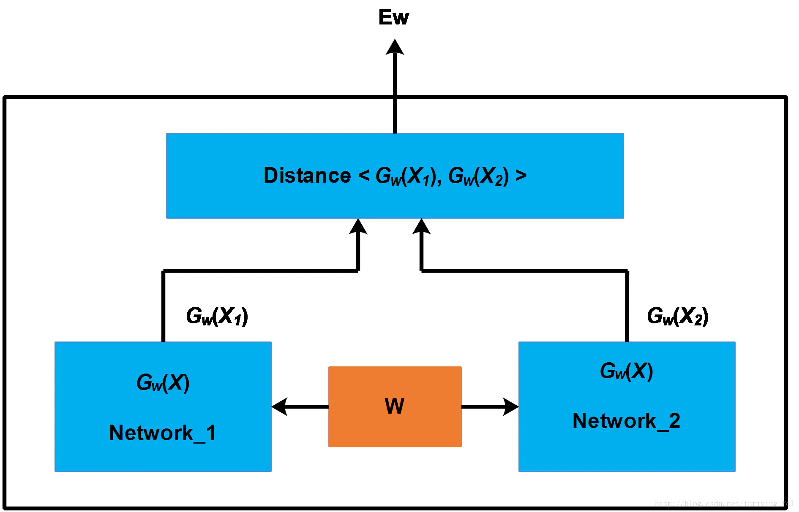
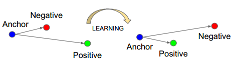
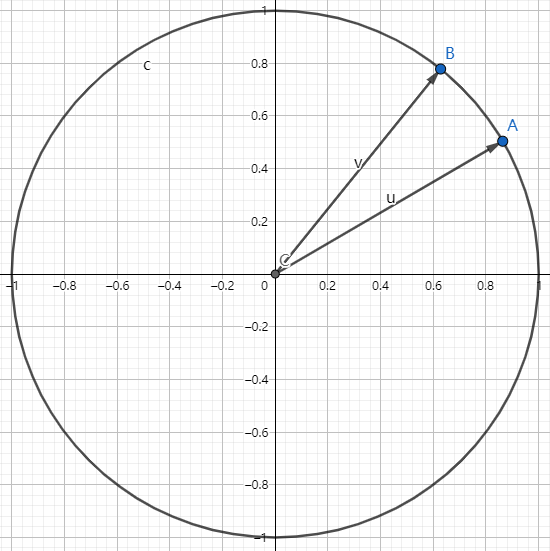
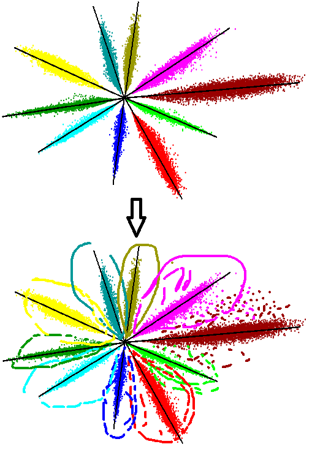
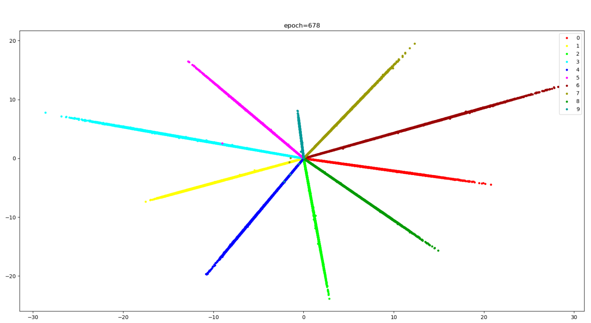
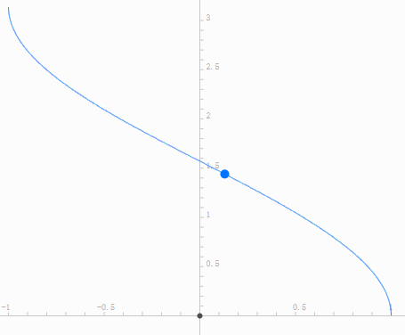
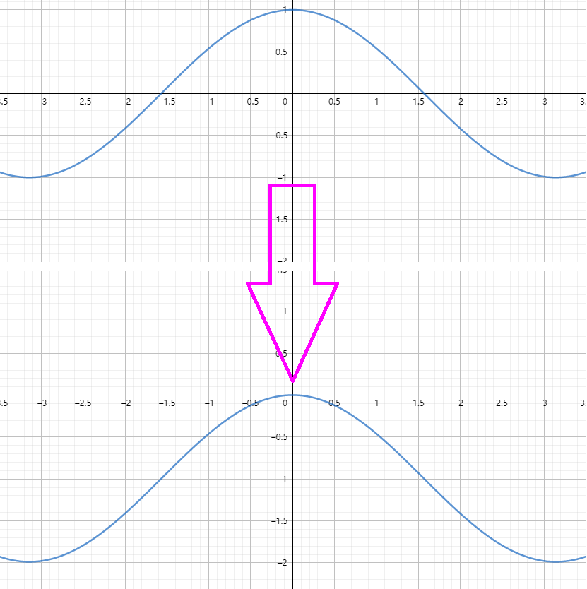
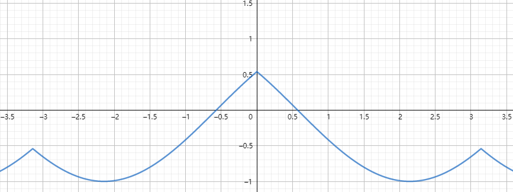
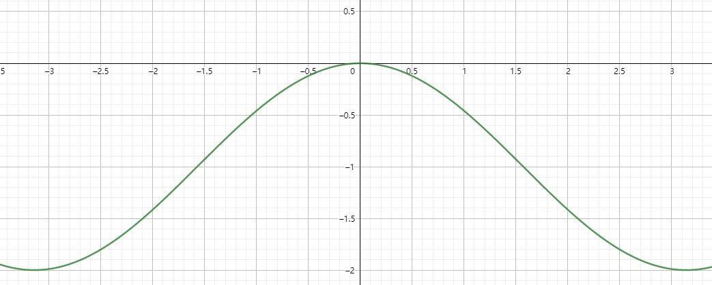
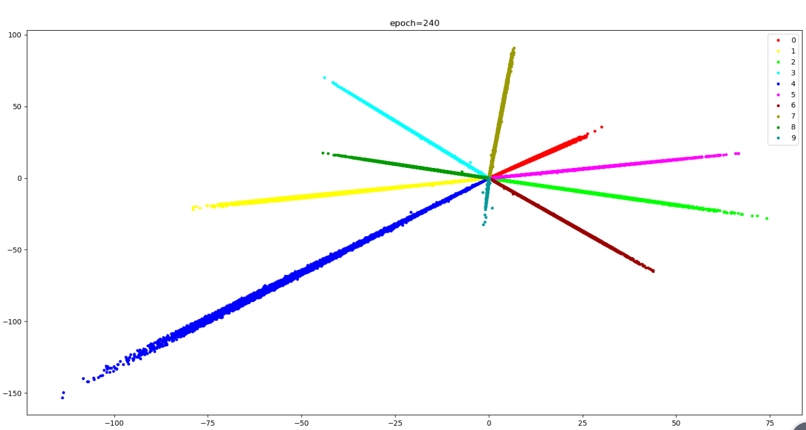

# Chapter03

[TOC]

# 三、图像识别

## 1、完成不定类别分类

图像识别依然是一个分类任务，但是并不是一个简单的分类任务，因为需要识别的种类的数量不定。同MTCNN将单目标检测网络变为可以进行多目标检测一样，将简单的二分类、十分类、转变为类别数不定的状态。

网络输出结果是固定的，却需要能够完成类别不定的目标。

手写数字十分类，将特征提取和分类放置于一体，同时完成，如此导致了特征的形状和分类的类别数需要统一。只需将特征提取，和特征对比，分开即可。

识别人脸则需训练一个特征提取器，将说需要识别的对象先通过网络提取一组特征，存放于数据库中，在使用时，则将目标提取的特征与数据库中存放的特征进行对比即可完成识别。

## 2、网络如何进行特征提取

在训练手写数字识别的网络中，将最后一层的输出，可视化出来查看。为了方便绘制于图，将该层输出设定为2，同时随着前向推导过程，返回出来。

[**C03FeatureVisualization.py**](Chapter03/C03FeatureVisualization.py)

```python
class Net(nn.Module):
    def __init__(self):
        super(Net, self).__init__()
        self.convolution1 = nn.Sequential(
            '''......'''
        )
        self.full_connect1 = nn.Sequential(
            nn.Linear(128, 2),
        )
        '''输出二维的特征向量，方便绘制于图上'''
        self.full_connect2 = nn.Sequential(
            nn.Linear(2, 10)
        )
    def forward(self,enter):
        xy = self.full_connect1(self.convolution1(enter).reshape(-1,128))
        '''将中间层的特征同时返回'''
        return self.full_connect2(xy),xy.detach().cpu().numpy()
```

在训练初期可以见到，输入不同数字的图片的时候，网络输出还是一片混乱，纷杂不清的。随着训练的继续，损失的不断降低。对各个类别的分类已能完全完成分类。当损失为0.000002时，已经完全可分。


但在人脸识别中，因为我们不可能实现收集所有人的人脸图像，因此在使用中总会遇到不在训练集中的人脸，这种情况下就要求CNN提取的**特征**（features）不仅是可分的，而且要具有较高的**判别度**。

每一类占据的面积有点大.通常情况下,我们希望每一类只占很小一部分。因为人脸有很多,如果训练的就占了这么大地方,如果添加了新的人脸呢...也就是期望模型能识别出在训练数据的标签中没有的分类。特征学习需要保证提取的特征具有普适性。

由于特征显著的类内变化，深度特征的判别能力不够。某些类内距离大于类间距离，判断特征的相似度将会非常困难。

## 3、CenterLoss

提高特征的判别度，需要**增大类间距，减小类内距**。

在这里，训练已至极致，即使增加网络广度和深度，也不能有所改善，可以考虑**增加损失**

给每个类定一个中心点，让本类数据向这个中心点靠近，直接减小类内距，间接增大类间距。

中心点因为样本的不同，加上网络学习的过程，各样本在空间中位置也是不断地发生变化，并不是固定的。然我们知道这个点的目标，即靠近样本的中心点。故，**将中心点定义为网络参数，让神经网络自行求解这个参数。**

同时又需要让每个样本点向着自己的中心点靠近。

这里需要完成两个任務：

1. 求得数据的中心点
2. 让数据向着中心点聚集


用同一类别的数据，到假定中心点的平局距离，作为损失值。即可同时完成上述两个目标，**当假定的中心点向着数据中心点靠拢的时候，平均距离会降低；当数据点向着中心点靠拢的时候，平均距离亦会靠拢。**如此，数据的向着假定中心点靠拢，也即整体数据的真实中心点在向着假定中心点靠拢；假定中心点亦在向着数据整体的真实中心点靠拢，即同时完成了求得数据中心点和让数据向着中心点聚集的任务。这便是**CenterLoss**。
$$
L_{c}\sum_{i=1}^{m}\left \| x_{i}-c_{yi} \right \|_{2}^{2}
$$
在多维空间中，两点距离公式为：
$$
dist(x,y)=\sqrt{\sum_{i=1}^{n}(x_{i}-y_{i})^{2}}
$$

[C03CenterLoss.py](Chapter03/C03CenterLoss.py)

```python
from torch import nn
import torch


class CenterLoss(nn.Module):

    def __init__(self, feature_number, class_number):
        """
        初始化中心损失(center loss)
        :param feature_number:特征的数量
        :param class_number:分类的数量
        """
        super(CenterLoss, self).__init__()
        self.class_number = class_number
        self.feature_number = feature_number

        '''将中心点定义为可以学习的参数'''
        self.center_point = nn.Parameter(torch.randn(class_number,feature_number), requires_grad=True)

    def forward(self, feature, target):
        """
        计算中心损失
        :param feature: 特征向量。
        :param target: 分类标签，未进行one_hot处理的。
        :return: 损失
        """
        '''通过标签，将每个点与各自对于的类别的中心点对应'''
        midpoint_tensor = self.center_point.index_select(dim=0, index=target.long())
        
        '''统计每个类别的数量'''
        target_hist = torch.histc(target.float(), self.class_number, min=0, max=self.class_number - 1)
        
        '''通过标签，将每个点的类别的数量与特征向量对应'''
        hist_tensor = target_hist.index_select(dim=0, index=target.long())

        '''计算损失，先计算多维空间中两点的欧式距离，再除去自身类别数，即平均。最后加和，求得总损失。'''
        return torch.sum(torch.sqrt(torch.sum(torch.pow(feature-midpoint_tensor,2),dim=1))/hist_tensor)
```

将centerlosss使用于手写数字识别上，特征图的边画画如下。

[C03FeatureVisualizationWithCenterLoss.py](Chapter03/C03FeatureVisualizationWithCenterLoss.py)

```python
'''......'''
loss2 = center_loss.forward(feature, target)
loss = loss1 + loss2
'''......'''
```

$$
L = L_{s}+\lambda L_{c}
$$

不同的$\lambda$会有不同下效果，下图为是其为1的时候的训练结果。


最终特征图收敛如上图所示。如需收敛为上图样，需无偏置。

最终使用，是使用余弦相似度进行比较。**二范数归一化的欧式距离等价于余弦相似度。**


## 4、孪生网络

孪生神经网络(Siamese Network)将输入映射为一个特征向量，使用两个向量之间的“距离”（L1 Norm）来表示输入之间的差异（图像语义上的差距）。



Siamese Network有两个结构相同，且共享权值的子网络。分别接收两个输入X1X1与X2X2，将其转换为向量Gw(X1)与Gw(X2)，再通过某种距离度量的方式计算两个输出向量的距离Ew。

在孪生神经网络（siamese network）中，其采用的损失函数是contrastive loss，这种损失函数可以有效的处理孪生神经网络中的paired data的关系。contrastive loss的表达式如下：
$$
L(W,(Y,X_{1},X_{2}))=\frac{1}{2N}\sum_{n=1}^{N}YD_{W}^{2}+(1-Y)max(m-D_{w},0)^{2}
$$

$$
D_{W}(X_{1},X_{W})=\left \| X_{1}-X_{2} \right \|_{2}=(\sum_{i=1}^{P}(X_{1}^{i}-X_{2}^{i})^{2})^{\frac{1}{2}}
$$

代表两个样本特征和 的欧氏距离（二范数）P 表示样本的特征维数，Y 为两个样本是否匹配的标签，Y=1 代表两个样本相似或者匹配，Y=0 则代表不匹配，m 为设定的阈值，N 为样本个数。

这里设置了一个阈值ｍ，表示我们只考虑不相似特征欧式距离在０～ｍ之间的，当距离超过ｍ的，则把其loss看做为０(即不相似的特征离的很远，其loss应该是很低的；而对于相似的特征反而离的很远，我们就需要增加其loss，从而不断更新成对样本的匹配程度

该网络的缺点为，**速度慢**。但启发了，**比较特征向量的差距**的思想。


## 5、Triplet Loss



Triplet Loss即三元组损失分为了Anchor、Negative、Positive需要三种数据，即三张图片。Anchor为锚点，参考点。Positive与锚点同属于一类样本。而Negative则和Anchor为不同类的样本。也就是说，让正样本(Positive)更加靠近锚点(Anchor)，而负样本(Negative)远离锚点(Anchor)。
$$
L_{triplet\ loss}=\sum_{i}^{N}\left [ \left \| f(x_{i}^{a})-f(x_{i}^{p}) \right \|_{2}^{2}- \left \|f(x_{i}^{a})-f(x_{i}^{n})  \right \|_{2}^{2}+\alpha \right ]_{+}
$$
该损失为，正样本到锚点的距离减去负样本到锚点的距离加上$\alpha$ 。

另外这里距离用欧式距离度量，+表示[]内的值大于零的时候，取该值为损失，小于零的时候，损失为零。

**$\alpha$ 值设置的越小，loss 很容易趋近于 0 ，但很难区分相似的图像。$\alpha$  值设置的越大，loss 值较难趋近于 0，甚至导致网络不收敛，但可以较有把握的区分较为相似的图像。**

训练的时候，传入的数据，需要正样本到锚点距离，大于负样本到锚点的距离。故随着训练的进行，训练样本可能不满足这样的条件，则需要剔除这一部分数据。越训练，样本越少，所需要的困难样本难以寻找。

故该损失难以训练。

## 6、A-Softmax

$$
softmax(x_{i})=\frac{e^{x_{i}}}{\sum_{j=1}^{n}e^{x_{j}}}
$$

网络在最后层(线性分类层)的结果，传入softmax()函数计算的时候，在没有偏置的情况下。

可以写为
$$
softmax(\vec{X})=\frac{e^{\vec{X}\cdot \vec{W}}}{\sum_{j=1}^{n}e^{\vec{X_{j}}\cdot \vec{W_{j}}}}
$$
而两向量相乘，又可以写为：
$$
\vec{X}\cdot \vec{W}=\left | \vec{X} \right |\times \left | \vec{W} \right |\times cos(\theta )
$$
则：
$$
softmax(x_{i})=\frac{e^{\left |\vec{X}_{i}\right |\cdot \left |\vec{W}_{i}\right |cos(\theta_{i})}}{\sum_{j=1}^{n}e^{\left |\vec{X}_{j}\right |\cdot \left |\vec{W}_{j}\right |cos(\theta_{j})}}
$$


## 7、Arc Face Loss

$$
Arc\_Face\_Loss = -\frac{1}{N}\sum_{i=1}^{N}log\frac{e^{s\times  cos(\theta_{y_{i}}+m)}}{e^{s\times cos(\theta_{y_{i}}+m)}+\sum_{j=1,j\neq y_{i}}^{n}e^{s\times cos(\theta_{j})}}
$$

其中**s**为$\vec{X} \cdot \vec{W}$的模

如果对其做二范数归一化之后，则为1。

以上述手写数字识别，输出特征数量为2,。



在对网络输入特征和最后一层线性分类层（无偏置）做二范数归一化后，作为二维向量，画于图上，A为某一类别的分类参数向量，B为特征向量。则特征向量与每一个神经元的参数构成的向量，求余弦角。

如果输入的特征向量，与某一类别的参数向量的夹角更小，则余弦值更大，那么softmax之后，则的值更大。

基于此，我们给其和所属的类别的参数向量的$\theta$的角度增加一个m的角度值。



则对于最后一层分类层来讲，它所看到的特征图就不再是可以清晰分开的了，而是会交杂在一起。所以会有动力，要求前面的神经网络，提取到更加清晰可分的特征，如此到最后一层线性分类层所看到的图像，没有增加角度偏置的图像的时候，实际得到的特征图像，已经变成了下图所示样子。基本同一类别



于是按照公式写出代码[C03ArcFaceLoss.ArcFaceLoss](Chapter03/C03ArcFaceLoss.py)：

```python
class ArcFaceLoss(nn.Module):

    def __init__(self, num_features, num_categories, angle):
        super(ArcFaceLoss, self).__init__()
        self.num_features = num_features
        self.num_categories = num_categories
        self.angle = angle
        self.w = nn.Parameter(torch.randn(self.num_features, self.num_categories))

    def forward(self, features, target):
        target = target.unsqueeze(dim=1)
        features_modulus = torch.sum(features ** 2, dim=1, keepdim=True) ** 0.5
        w_modulus = torch.sum(self.w ** 2, dim=0, keepdim=True) ** 0.5
        modulus = features_modulus * w_modulus
        cos_theta = torch.matmul(features, self.w) / modulus
        theta = torch.acos(cos_theta) + self.angle
        cos_theta_plus = torch.cos(theta)
        top = torch.exp(modulus * cos_theta_plus).gather(dim=1, index=target)
        down_ = torch.exp(torch.matmul(features, self.w))
        down = down_.sum(dim=1, keepdim=True) - down_.gather(dim=1, index=target) + top
        return -torch.log(top / down).sum() / len(target)
```

然而只是按照公式所编写的程序，容易出现问题。



原因出在，计算a$rccos(cos\theta)$的时候，当$cos\theta$为±1的时候，其arccos求导，导数为无穷大，则对于计算机来讲，梯度爆炸，已经无法计算。所以需要进行特殊化处理。

首先想到对a$rccos(cos\theta)$函数进行改写，将其导数为无穷出的值，规定为一个较小的值即可：

```python
class MyArcCos(torch.autograd.Function):

    @staticmethod
    def forward(ctx, input):
        ctx.save_for_backward(input)
        return torch.acos(input)

    @staticmethod
    def backward(ctx, grad_output):
        input, = ctx.saved_tensors
        grad_input = -(1-input**2)**(-0.5)
        grad_input[input >= 0.99] = -7.0888
        grad_input[input <= -0.99] =-7.0888
        return grad_input*grad_output
```

然而结果，在训练时依旧会产生梯度爆炸。只是减缓了到来的时间。

另外一种处理方式为：

[C03ArcFaceLoss.ArcFace](Chapter03/C03ArcFaceLoss.py)

```python
def forward(self, feature):
    feature = nn.functional.normalize(feature, dim=1)
    w = nn.functional.normalize(self.w, dim=0)
    cos_theta = torch.matmul(feature,w)/self.s
    theta = torch.acos(cos_theta)
    _top = torch.exp(self.s*torch.cos(theta))
    top = torch.exp(self.s*(torch.cos(theta + self.angle)))
    under = torch.sum(torch.exp(cos_theta*self.s),dim=1,keepdim=True)
    return (top/(under - _top+top))
```

如此，公式的分子的计算则变为了：
$$
e^{s\times10\times  cos(arccos(\frac{1}{10}\times cos(\theta_{y_{i}}))+m)}
$$
为何依然有效呢？

$cos\theta$除以10后，它的值域压缩至了（-0.1,0.1）

则对其求反函数，$arccos(cos\theta)$的值域为（1.671，1.471）

再加上一个角度之后，求cos，再乘以10，时。

此时：$f(\theta)$的图像变化如下。



按照原始公式，$f(\theta)$的图像变化如下



特殊处理之后的，相较于原始公式，图像不再有不可导的点以外，整体趋势是相同的。并且处理之后的图形，更加平滑，完全是将$cos\theta$向下平移的样式。

其训练收敛效果如下所示。


### 小记：

发现arcface作处理后的$cos\theta$的图像上看，是往下移动了接近1，于是我试着

```python
def forward(self, features, target):
    target = target.unsqueeze(dim=1)
    features = torch.nn.functional.normalize(features, dim=1)
    w = torch.nn.functional.normalize(self.w, dim=0)
    cos_theta = torch.matmul(features, w)
    cos_theta_plus = cos_theta-1.0
    top = torch.exp(cos_theta_plus).gather(dim=1, index=target)
    down_tempy = torch.exp(cos_theta)
    down = down_tempy.sum(dim=1, keepdim=True) - down_tempy.gather(dim=1, index=target) + top
    return -torch.log(top / down).sum() / len(target)
```

也即，公式变化为
$$
Loss = -\frac{1}{N}\sum_{i=1}^{N}log\frac{e^{s\times  (cos(\theta_{y_{i}})-1.0)}}{e^{s\times (cos(\theta_{y_{i}})-1.0)}+\sum_{j=1,j\neq y_{i}}^{n}e^{s\times cos(\theta_{j})}}
$$
其函数图像为：



其图像和Arc Face Loss相似，但收敛效果没有Arc Face Loss好。



同时，在上述实验中，在对arc face loss的训练中，损失计算是传入CrossEntropyLoss()中进行的，该函数自带有softmax()函数，也就是说，在对arc face后的结果在进行一次softmax归一化后，的效果会更好。

为什么会更加好呢？

我认为，例如，其中，对一个样本，输出的特征，和该类别的特征参数的余弦夹角为0°，$cos\theta=1$，然后通过惩罚后，$cos(\theta+m)=0$,而与其他的特征参数向量的夹角为180°，即负相关的话，惩罚后的结果为$cos(\theta+m)=-2$，则实际输出的分类结果为：

```python
tensor([0.2320, 0.0233, 0.0233, 0.0233, 0.0233, 0.0233, 0.0233, 0.0233, 0.0233, 0.0233])
```

如果再经过softmax函数后，结果为：

```python
tensor([0.1204, 0.0977, 0.0977, 0.0977, 0.0977, 0.0977, 0.0977, 0.0977, 0.0977, 0.0977])
```

可以看到，1类所占的概率降低了，则在做交叉熵的时候，会得到较大的损失，则网络更加具有学习更加清晰可分特征的动力。