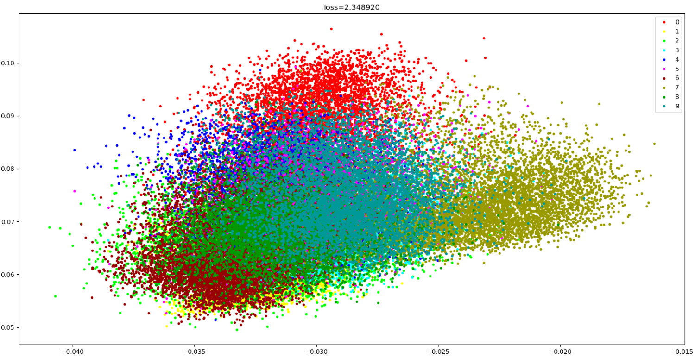
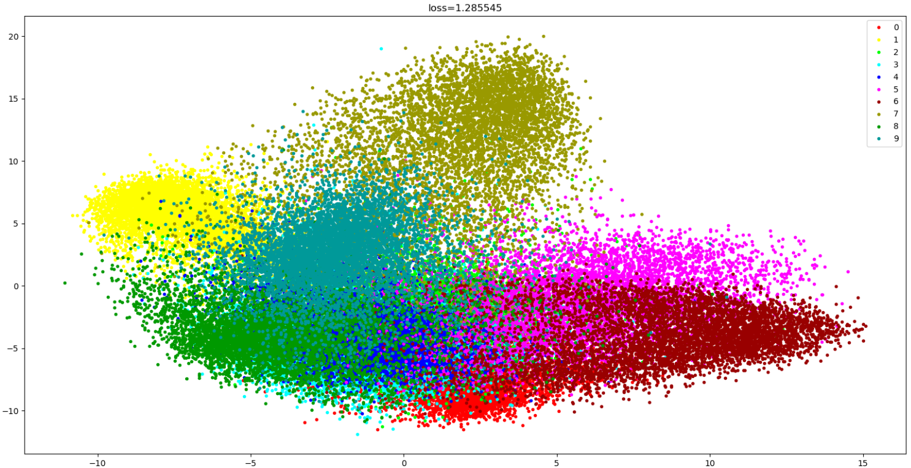
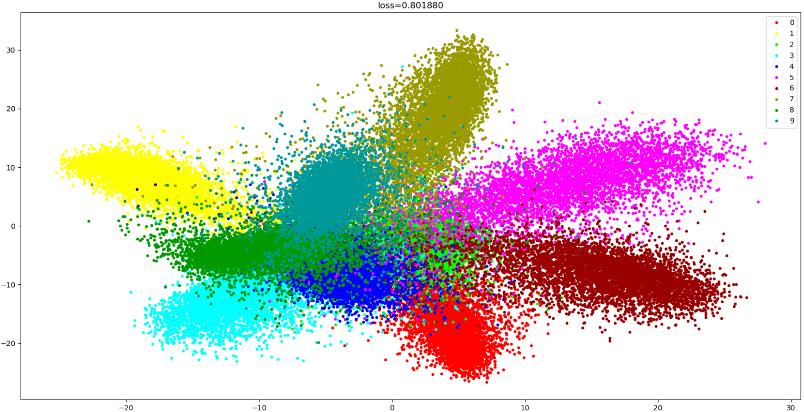
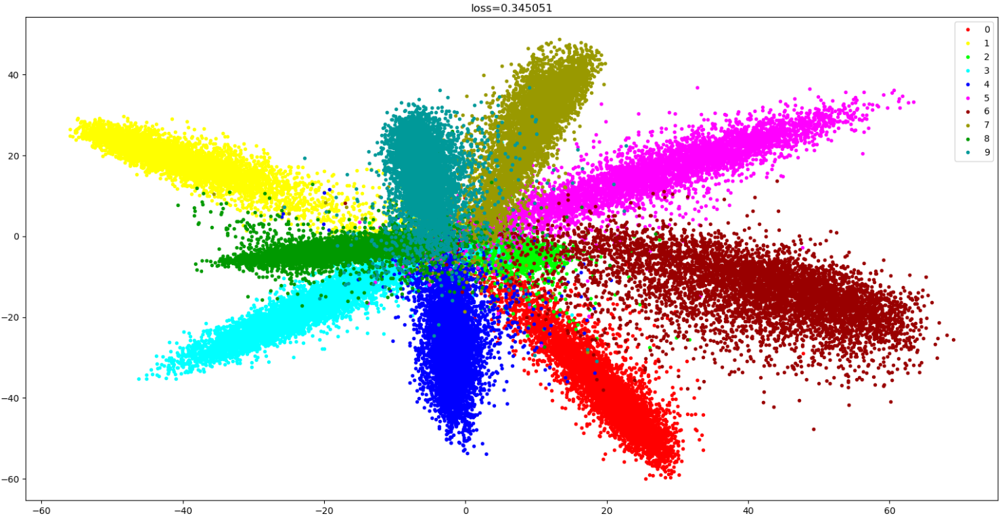
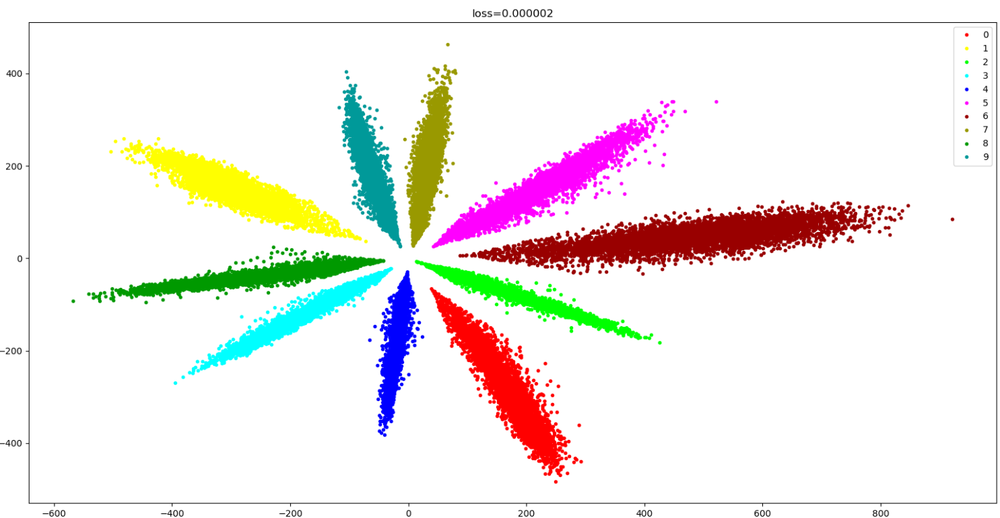
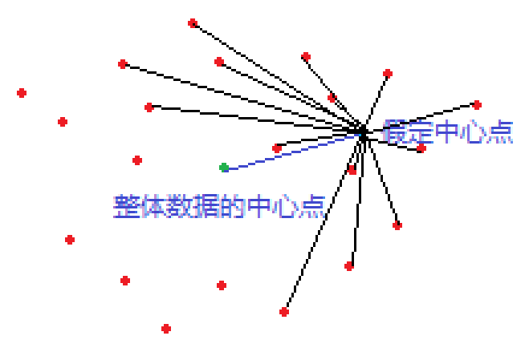
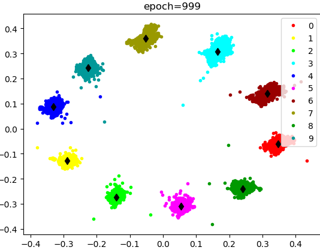

# Chapter03

[TOC]

# 三、图像识别

## 1、完成不定类别分类

图像识别依然是一个分类任务，但是并不是一个简单的分类任务，因为需要识别的种类的数量不定。同MTCNN将单目标检测网络变为可以进行多目标检测一样，将简单的二分类、十分类、转变为类别数不定的状态。

网络输出结果是固定的，却需要能够完成类别不定的目标。

手写数字十分类，将特征提取和分类放置于一体，同时完成，如此导致了特征的形状和分类的类别数需要统一。只需将特征提取，和特征对比，分开即可。

识别人脸则需训练一个特征提取器，将说需要识别的对象先通过网络提取一组特征，存放于数据库中，在使用时，则将目标提取的特征与数据库中存放的特征进行对比即可完成识别。

## 2、网络如何进行特征提取

在训练手写数字识别的网络中，将最后一层的输出，可视化出来查看。为了方便绘制于图，将该层输出设定为2，同时随着前向推导过程，返回出来。

[**C03FeatureVisualization.py**](Chapter03/C03FeatureVisualization.py)

```python
class Net(nn.Module):
    def __init__(self):
        super(Net, self).__init__()
        self.convolution1 = nn.Sequential(
            '''......'''
        )
        self.full_connect1 = nn.Sequential(
            nn.Linear(128, 2),
        )
        '''输出二维的特征向量，方便绘制于图上'''
        self.full_connect2 = nn.Sequential(
            nn.Linear(2, 10)
        )
    def forward(self,enter):
        xy = self.full_connect1(self.convolution1(enter).reshape(-1,128))
        '''将中间层的特征同时返回'''
        return self.full_connect2(xy),xy.detach().cpu().numpy()
```

在训练初期可以见到，输入不同数字的图片的时候，网络输出还是一片混乱，纷杂不清的。随着训练的继续，损失的不断降低。对各个类别的分类已能完全完成分类。当损失为0.000002时，已经完全可分。











但在人脸识别中，因为我们不可能实现收集所有人的人脸图像，因此在使用中总会遇到不在训练集中的人脸，这种情况下就要求CNN提取的**特征**（features）不仅是可分的，而且要具有较高的**判别度**。

每一类占据的面积有点大.通常情况下,我们希望每一类只占很小一部分。因为人脸有很多,如果训练的就占了这么大地方,如果添加了新的人脸呢...也就是期望模型能识别出在训练数据的标签中没有的分类。特征学习需要保证提取的特征具有普适性。

由于特征显著的类内变化，深度特征的判别能力不够。某些类内距离大于类间距离，判断特征的相似度将会非常困难。

## 3、CenterLoss

提高特征的判别度，需要**增大类间距，减小类内距**。

在这里，训练已至极致，即使增加网络广度和深度，也不能有所改善，可以考虑**增加损失**

给每个类定一个中心点，让本类数据向这个中心点靠近，直接减小类内距，间接增大类间距。

中心点因为样本的不同，加上网络学习的过程，各样本在空间中位置也是不断地发生变化，并不是固定的。然我们知道这个点的目标，即靠近样本的中心点。故，**将中心点定义为网络参数，让神经网络自行求解这个参数。**

同时又需要让每个样本点向着自己的中心点靠近。

这里需要完成两个任務：

1. 求得数据的中心点
2. 让数据向着中心点聚集



用同一类别的数据，到假定中心点的平局距离，作为损失值。即可同时完成上述两个目标，**当假定的中心点向着数据中心点靠拢的时候，平均距离会降低；当数据点向着中心点靠拢的时候，平均距离亦会靠拢。**如此，数据的向着假定中心点靠拢，也即整体数据的真实中心点在向着假定中心点靠拢；假定中心点亦在向着数据整体的真实中心点靠拢，即同时完成了求得数据中心点和让数据向着中心点聚集的任务。这便是**CenterLoss**。
$$
L_{c}\sum_{i=1}^{m}\left \| x_{i}-c_{yi} \right \|_{2}^{2}
$$
在多维空间中，两点距离公式为：
$$
dist(x,y)=\sqrt{\sum_{i=1}^{n}(x_{i}-y_{i})^{2}}
$$

[C03CenterLoss.py](Chapter03/C03CenterLoss.py)

```python
from torch import nn
import torch


class CenterLoss(nn.Module):

    def __init__(self, feature_number, class_number):
        """
        初始化中心损失(center loss)
        :param feature_number:特征的数量
        :param class_number:分类的数量
        """
        super(CenterLoss, self).__init__()
        self.class_number = class_number
        self.feature_number = feature_number

        '''将中心点定义为可以学习的参数'''
        self.center_point = nn.Parameter(torch.randn(class_number,feature_number), requires_grad=True)

    def forward(self, feature, target):
        """
        计算中心损失
        :param feature: 特征向量。
        :param target: 分类标签，未进行one_hot处理的。
        :return: 损失
        """
        '''通过标签，将每个点与各自对于的类别的中心点对应'''
        midpoint_tensor = self.center_point.index_select(dim=0, index=target.long())
        
        '''统计每个类别的数量'''
        target_hist = torch.histc(target.float(), self.class_number, min=0, max=self.class_number - 1)
        
        '''通过标签，将每个点的类别的数量与特征向量对应'''
        hist_tensor = target_hist.index_select(dim=0, index=target.long())

        '''计算损失，先计算多维空间中两点的欧式距离，再除去自身类别数，即平均。最后加和，求得总损失。'''
        return torch.sum(torch.sqrt(torch.sum(torch.pow(feature-midpoint_tensor,2),dim=1))/hist_tensor)
```

将centerlosss使用于手写数字识别上，特征图的边画画如下。

[C03FeatureVisualizationWithCenterLoss.py](Chapter03/C03FeatureVisualizationWithCenterLoss.py)

```python
'''......'''
loss2 = center_loss.forward(feature, target)
loss = loss1 + loss2
'''......'''
```

$$
L = L_{s}+\lambda L_{c}
$$

不同的$\lambda$会有不同下效果，下图为是其为1的时候的训练结果。




最终特征图收敛如上图所示。