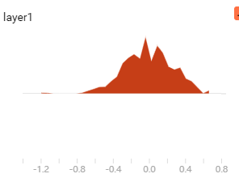
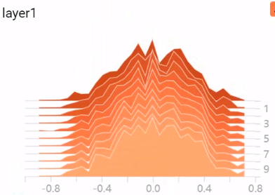
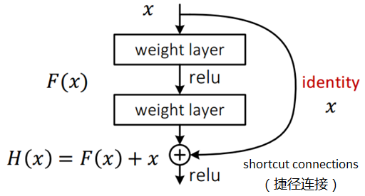
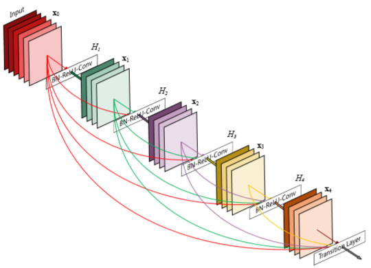
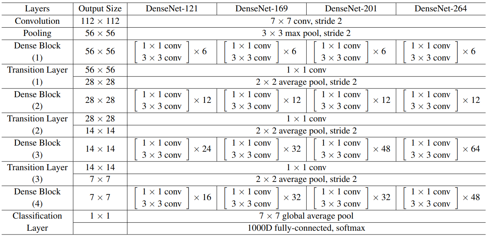

# Chapter4

# 四、模型设计

[TOC]


## 1、损失函数

### 1.1均方差MSELoss

$$
MSELoss=\frac{1}{N}\sum_{i=1}^{N}\left ( y_{i}-\widehat{y}_{i} \right )^{2}
$$

其中：

\-$y_{i}$ ——表示样本$i$的标签值；

-$\widehat{y}_{i}$  ——表示样本$i$预测的值；

```python
torch.nn.MSELoss()
```

实际结果和观测结果之间差距的平方的均值。

### 1.2交叉熵

#### 	1.2.1当任务为二分类时

$$
BCELoss = -\frac{1}{N}\sum_{i=1}^{N}y_{i}log(p_{i})+(1-y_{i})log(1-p_{i})
$$

其中：

\-$y_{i}$ ——表示样本$i$的标签值，正类为1，负类为0；

-$p_{i}$  ——表示样本$i$预测为正的概率；

```python
torch.nn.BCELoss()
```

1）当某个样本的真实标签y=1时，Loss=−lop(p),分类器的预测概率p=Pr(y=1)的概率越小，则分类损失就越大；反之，分类器的预测概率p=Pr(y=1)的概率越大，则分类损失就越小。

2）对于真实标签y=0，Loss=−log(1−p),分类器的预测概率p=Pr(y=1)的概率越大，则损失越大。

#### 	1.2.2任务为多分类时

$$
CrossEntropyLoss=\frac{1}{N}\sum_{i=1}^{N}[-\sum_{j=1}^{M}y_{ij}log(p_{ij})]
$$

或是：
$$
CrossEntropyLoss=\frac{1}{N}\sum_{i=1}^{N}[\sum_{j=1}^{M}y_{ij}log(\frac{1}{p_{ij}})]
$$
其中：

-$M$ ——类别的数量；

-$y_{ij}$ ——第$i$个数据，的第$j$类别的one—hot标签，,如果该类别和样本i的类别相同就是1，否则是0；

-$p_{ij}$ ——对于观测样本$i$属于类别$j$的预测概率;

```python
torch.nn.CrossEntropyLoss()
```

逻辑回归配合MSE损失函数时，采用梯度下降法进行学习时，会出现模型一开始训练时，学习速率非常慢的情况。而使用逻辑函数得到概率，并结合交叉熵当损失函数时，在模型效果差的时候学习速度比较快，在模型效果好的时候学习速度变慢。

## 2、Dropout

Dropout是指在深度学习网络的训练过程中，对于神经网络单元，按照一定的概率将其暂时从网络中丢弃。注意是暂时，对于随机梯度下降来说，由于是随机丢弃，故而每一个mini-batch都在训练不同的网络。随机的抑制部分神经元，不参与神经网络训练。

[Dropout](https://blog.csdn.net/stdcoutzyx/article/details/49022443)强迫一个神经单元，和随机挑选出来的其他神经单元共同工作，达到好的效果。消除减弱了神经元节点间的联合适应性，增强了泛化能力。

计算过程为，每一个数值都按照概率置为零。但是训练的时候会停止训练一些神经元，而测试的时候，整个模型是完整，可不会dropout 任何神经元。所以，在训练的时候，会对**没有被dropout的神经元权值做一个rescale**。即输出按照 $p$ 的概率置零，其他数值乘上$rescale$。
$$
rescale=\frac{1}{1-p}
$$
在使用的时候，则没有dropout，也不会增幅这一$rescale$的系数

则模型在训练的时候，使用了dropout，则训练时需要调用方法：

```python
net().train()  # 实际训练时，会自动调用
```

然后在使用时，需要调用方法：

```python
net.eval()
```


## 3、正则化

目标函数后面添加一个系数的“**惩罚项**”是正则化的常用方式，为了防止系数过大从而让模型变得复杂。

使用：

```python
optimizer = torch.optim.Adam(net.parameters(),weight_decay=0.1)
```

weight_decay参数默认为零，传参即可使用正则。

也可以手动实现：

```python
for param in net.parameters():
	L2 += torch.sum(param**2)
loss = 0.01*L2+loss_func(y,target)
```


## 4、权重初始化

### 4.1 目的

- 因为对权重$w$的大小和正负缺乏先验，所以应初始化在零附近，但不能为全零或常数，所以要有一定的随机性，即数学期望$E(w) = 0$;
- 因为梯度消失和梯度爆炸，权重不宜过大或过小，所以要对权重的方差$Var(w)$有所控制；
- 因为神经网络的多层结构中，每个激活层的输出对后面层而言都是输入，所以我们希望不同激活层输出的方差相同，即$Var(a^{l})=Var(a^{l+1}))$,这也就意味着，不同激活层输入的方差相同，$Var(z^{l})=Var(z^{l+1}))$;
- 如果忽略激活函数，前向传播和反向传播可以看成是权重矩阵（转置）的连续相乘，数值太大，前向时可能陷入饱和区，反向时可能梯度爆炸，数值太小，反向时可能梯度消失，所以初始化时，权重的数值范围（方差）应考虑前向和后向两个过程。

### 4.2初始化方法

#### 	1）Xavier初始化

$$
W \sim N(0,\frac{2}{n_{in}+n_{out}})
$$

不考虑激活函数，只利用状态值，既考虑正向传播又考虑反向传播，使用调和平均数，得到$Var(w) = \frac{2}{n_{in}+n_{out}}$

或是从均匀分布中取：
$$
W \sim U(-\sqrt{\frac{6}{n_{in}+n_{out}}},\sqrt{\frac{6}{n_{in}+n_{out}}})
$$

#### 	2）Kaiming初始化

考虑激活函数(ReLu)，既考虑正向又考虑反向传播，但是只任取其一即可，得到
$$
W \sim N(0,\frac{2}{n_{in}})
$$
或是：
$$
W \sim N(0,\frac{2}{(1+a^{2})n_{in}})
$$
$n_{in}$为参数的数量。

其中，手动初始化参数：

```python
conv = nn.Conv2d(3,16,3,1)
print(conv.weight.mean())
print(conv.weight.var()**2)
nn.init.kaiming_normal_(conv.weight,nonlinearity='relu')  # 调用开明初始化，针对的是relu函数
print(conv.weight.mean())
print(conv.weight.var()**2)
```

结果：

```python
tensor(-0.0008, grad_fn=<MeanBackward0>)
tensor(0.0001, grad_fn=<PowBackward0>)
tensor(-0.0168, grad_fn=<MeanBackward0>)
tensor(0.0052, grad_fn=<PowBackward0>)
```

均值变为0附近，方差确实变为了$\frac{2}{n_{in}}=\frac{2}{3\times 16\times 3\times 3}=0.004629$。

还有：

```python
torch.nn.init.normal_(tensor, mean=0., std=1.)
torch.nn.init.zeros_(tensor)
torch.nn.init.xavier_normal_(tensor, gain=1.)
```

#### 	3）批量初始化

定义一个函数，通过判断属于哪一种类型，来进行不同的初始化

[C04WeightInit.py](Chapter04/C04WeightInit.py)

```python
def weight_init(m):
    '''判断该对象是否是一个已知的类型'''
    if isinstance(m, nn.Conv2d):
        '''进行凯明初始化'''
        nn.init.kaiming_normal_(m.weight)
        if m.bias is not False:
            '''零初始化'''
            nn.init.zeros_(m.bias)
    elif isinstance(m, nn.Linear):
        '''正态分布初始化'''
        nn.init.normal_(m.weight)
        if m.bias is not False:  
            nn.init.zeros_(m.bias)
```

使用使，只需要在模型的构建的\__init__()方法中使用apply()方法即可：

```python
class Net(nn.Module):

    def __init__(self):
        super(Net, self).__init__()
        '''......'''
        self.apply(weight_init)

    def forward(self, input_):
        '''......'''
```

### 4.3 查看权重分布

```python
summary_writer = SummaryWriter('D:/data/chapter4/logs')
layer1 = net.conv1[0].weight
summary_writer.add_histogram('layer1',layer1)
```

则查看初始化权重：



也可以给步长，在训练中，查看权重的变化情况

```python
summary_writer.add_histogram('layer1',layer1,global_step=epoch)
```



此外还可以查看训练的数据情况：

```python
summary_writer.add_images('image',image)
```


## 5、BatchNormal

即批次标准化。

由于训练过程中各层输入的分布随着前几层参数的变化而变化，使得训练深度神经网络变得复杂。这通过要求**较低的学习速率**和**仔细的参数**初始化来减慢训练，并且使得训练具有饱和非线性的模型变得非常困难。

在train网络之前，会对数据进行归一化处理，为的是保持训练和测试数据的分布相同，而在神经网络内部，每一层我们都需要有输入和输出，除了对原始数据的标准化处理，在经过网络每一层计算后的数据，它们的分布是不同的。网络的训练，需要去学习适应不同的数据分布，明显造成的后果就是收敛慢，效果不佳。这种现象称为 **内部协变量偏移**（internal covariate shift）。


计算公式为：
$$
y = \frac{x - \mathrm{E}(x)}{ \sqrt{\mathrm{Var}(x) + \epsilon}} * \gamma + \beta
$$

**变换后某个神经元的激活x形成了均值为0，方差为1的正态分布，目的是把值往后续要进行的非线性变换的线性区拉动，增大导数值，增强反向传播信息流动性，加快训练收敛速度。**但是这样会导致网络表达能力下降，为了防止这一点，每个神经元增加两个调节参数（scale和shift），这两个参数是通过训练来学习到的，用来对变换后的激活反变换，使得网络表达能力增强。

好处：

- **可以使用更大的学习率**，训练过程更加稳定，极大提高了训练速度。
- **可以将bias置为0**，因为Batch Normalization的标准化（Standardization）过程会移除直流分量，所以不再需要偏移量。
- **对权重初始化不再敏感**，通常权重采样自0均值某方差的高斯分布，以往对高斯分布的方差设置十分重要，有了Batch Nomarlization后，对与同一输出节点相连的权重进行缩放，其标准差$\sigma$也会缩放相同的倍数，相互抵消。
- 对权重尺度不再敏感，尺度统一由$\gamma$参数控制，在训练中决定。
- **深层网络可以使用sigmoid和tanh了**，
- **Batch Normalization具有某种正则作用，不需要太依赖dropout，减少过拟合。**


## 6、残差网络

网络退化问题：在神经网络可以收敛的前提下，**随着网络深度增加，网络的表现先是逐渐增加至饱和，然后迅速下降**

如果存在某个$K$层的网络$f$是当前最优的网络，那么可以构造一个更深的网络，其最后几层仅是该网络$f$ 第$K$层输出的恒等映射(Identity Mapping)，就可以取得与$f$一致的结果；也许$K$还不是所谓“最佳层数”，那么更深的网络就可以取得更好的结果。总之，与浅层网络相比，更深的网络的表现不应该更差。因此，一个合理的猜测就是，对神经网络来说，恒等映射并不容易拟合。

既然神经网络不容易拟合一个恒等映射，那么一种思路就是构造天然的恒等映射。不再用多个堆叠的层直接拟合期望的特征映射,而是显式的用它们拟合一个残差映射。假设期望的特征映射为$H(x)$,那么堆叠的非线性层拟合的是另一个映射,也就是$F(x)=H(x)-x$。假设最优化残差映射比最优化期望的映射更容易,也就是$F(x)=H(x)-x$比$F(x)=H(x)$更容易优化,则极端情况下,期望的映射要拟合的是恒等映射，此时残差网络的任务是拟合$F(x)=0,$普通网络要拟合的是$F(x)=x$,明显前者更容易优化。

则：
$$
H(x)=F(x,W)+x
$$
在网络中，学习一个恒等映射，$H(x)\rightarrow x $即等价于宁残差部分为趋于零，即$F(x,W) \rightarrow  0$。

在前向传播时，**输入信号可以从任意低层直接传播到高层**。由于包含了一个天然的恒等映射，**一定程度上可以解决网络退化问题**。

即**残差单元可以以跳层连接的形式实现**，即将单元的输入直接与单元输出加在一起，然后再激活。



同时，将梯度的连乘在中间部分变为了加法，**以不经过任何中间权重矩阵变换直接传播到低层，一定程度上可以缓解梯度弥散问题（即便中间层矩阵权重很小，梯度也基本不会消失）**。可以认为**残差连接使得信息前后向传播更加顺畅。**

[C04ResNet.py](Chapter04/C04ResNet.py)

```python
class ResBlock(nn.Module):

    def __init__(self):
        super(ResBlock, self).__init__()
        self.res_conv1 = nn.Sequential(
            nn.Conv2d(in_channels=16, out_channels=16, kernel_size=3, stride=1, padding=1, bias=False),
            nn.PReLU(),
            nn.BatchNorm2d(16),
            nn.Conv2d(16, 16, 3, 1, 1, bias=False),
            nn.PReLU(),
            nn.BatchNorm2d(16)
        )

    def forward(self, input_):
        return self.res_conv1(input_) + input_
```

残差网络事实上是由多个浅的网络融合而成,它没有在根本上解决消失的梯度问题,只是避免了消失的梯度问题,因为它是由多个浅的网络融合而成，浅的网络在训练时不会出现消失的梯度问题,所以它能够加速网络的收敛。

## 7、DenseNet稠密连接网络


$$
x_{l}=H_{l}([x_{0},x_{1},...,x_{l-1}])
$$
$[x_{0},x_{1},...,x_{l-1}]$表示将0到l-1层的输出feature map做**concatenation**，也称路由。

0到l-1层的输出特征图（feature map）做通道合并（concatenation）

