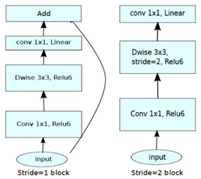
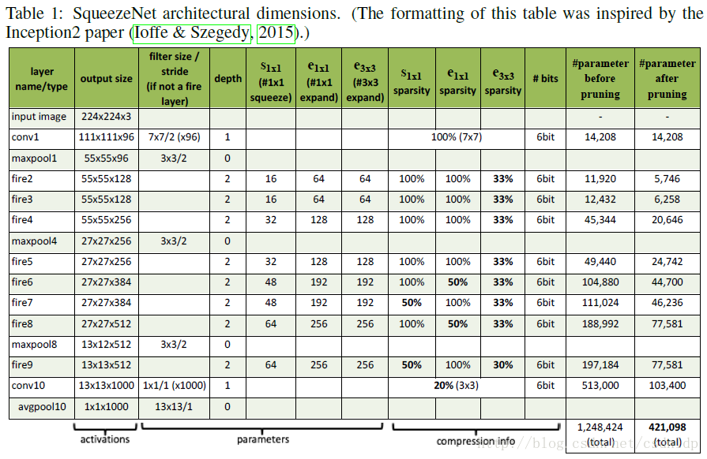
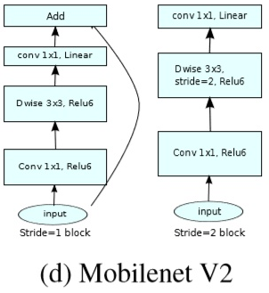

# Chapter05

# 高效模型

[TOC]

## 1、通道优化

### （1）1X1卷积与3X3卷积


3X3的卷积在输出的宽高维度上，1个特征值连接输入的9个值，也为像素融合。而在通道层面为全连接的形式。

1X1的卷积在输出的宽高维度上，1个特征值连接输入的1个值通道层面为全连接的形式。1x1卷积则在空间上没有融合，只在通道间进行信息融合。

1X1卷积与3X3卷积在通道层面皆为全连接形式。

### （2）分离卷积

将通道层面的全连接转变为局部连接。通过将卷积进行分组，来完成。


在未分组前，卷积核的个数为6，卷积核大小为3X3，其通道数为6，以全连接的方式完成计算：


将其分组之后，则把输入的通道数，等分为两部分。这样卷积核的变为了3X3的大小，每个通道数降为3，数量不变为6。将第一组的三个通道的输入和第一组的3个卷积核做卷积运算，得到3个通道的输出；第二组的通道输入和第二组的3个卷积核做卷积运算，得到3个通道的输出。将两组输出结果的通道合并，则完成了这次分离卷积的运算。将**通道的全连接变为了局部连接**


则连接形式变为了如此：


要使用分离卷积使用代码，给groups传参数即可：

```python
nn.Conv2d(6,6,3,1,groups=2)  # groups参数需要能输入输出通道数整除它
```


当分组数等于输入通道数时，即为**深度卷积**（Depthwise Convolution），它的一个卷积核负责一个通道，一个通道只被一个卷积核卷积。**不进行通道融合**。如果问题涉及通道问题，则不能全用深度卷积。


### （3）分离卷积的计算量

查看浮点计算量

安装thop，`pip install thop`

[P5Calculation.py](Chapter05/P5Calculation.py)

```python
class NetV1(nn.Module):
    def __init__(self):
        super(NetV1, self).__init__()
        self.conv1 = nn.Conv2d(6, 30, 3, 1)

    def forward(self, input_):
        return self.conv1(input_)
```

需要将模块写入模型中，分别计算以下四种分组的情况：

```python
nn.Conv2d(6, 30, 3, 1)
nn.Conv2d(6,30,3,1,groups=2)
nn.Conv2d(6,30,3,1,groups=3)
nn.Conv2d(6,30,3,1,groups=6)
```

查看自己模型的计算量`thop.profile(model=net1, inputs=(x,))`,输入按照元祖形式输入。

提升输出的可读性，调用`thop.clever_format()`进行格式化输出。

```python
x = torch.randn(1, 6, 112, 112)
amount_of_calculation = thop.profile(net1, (x,))
print(thop.clever_format(amount_of_calculation))
```

输出结果：

```python
('19.96M', '1.65K')
('10.16M', '840.00B')
('6.90M', '570.00B')
('3.63M', '300.00B')
```

**随着分组的增加，参数量和计算量都在下降。**


### （4）通道混洗（Channel shuffle）


考虑速读，使用1X1的深度可分离卷积，在像素和通道层面都没有融合的情况，如此使用通道混洗。

目的：**在不增加计算量的情况下，使通道充分融合**。

做法：[P5ChannelShuffle.py](Chapter05/P5ChannelShuffle.py)

```python
x = torch.randn(4,6,3,3)
y = x.reshape(4,2,3,3,3)  # 变形
z = y.permute(0,2,1,3,4)  # 换轴处理
v = z.reshape(4,6,3,3)  # 变回初始形状
print(v.shape)
```

缺点，连接过于稀疏，同时参数量非常少。会对精度有影响。


## 2、高效模型块

### （1）残差的瓶颈解构ResNet(Bottleneck)


先通过1X1的卷积，进行通道融合，同时将通道数减至64，然后3X3卷积进行像素融合，再通过1X1的卷积将通道还原至256，加上残差。

在通道层面先进行压缩，再还原回去。这种类似自编码结构，这种**瓶颈解构有利于特征提取**。

在将数据压缩后，又还原回去，将压缩前和还原后做损失的话，如果能将提取的特征能够很好的还原，则提取的特征具有更好的激励效果。

### （2）残差XT（ResNeXt）


相比**ResNet(Bottleneck)**减弱了通道的降低量，即256减至128通道，再使用32分组卷积，最后升回256。

### （3）MobileNetV1


先使用3X3进行像素融合，通道不进行任何操作的深度可分离卷积，再使用1X1卷积，进行通道融合。

优点：速度快、

缺点：参数特别少、精度比较低（主要由参数少导致）。

### （4）MobileNetV2




相比V1版本，精度提升，速度相近。

先用1X1卷积升通道，再用深度卷积融合像素，再1X1降通道

### （5）混洗网络ShuffleNet


1. 先1X1的分组卷积。
2. 混洗通道。
3. 再3X3的深度可分离卷积，进行像素融合。
4. 最后分组卷积。

则2步骤的通道混洗，使两次的分组卷积的组与组之间达到了融合的目的。

## 3、卷积分解


- 对于两层3×3的卷积层而言

- 最上面一层的3×3卷积层，每个1×1区域的感知野都是3×3

- 第二层的3×3卷积层，每个1×1区域的感知野还是3×3

- 所以两层3×3卷积层，叠加效果可以覆盖一个5乘5的区域，既是两层3×3卷积层，可以获得一个5×5的感知野。

  即，使用两层3X3代替一层5X5的卷积操作。
  
  **优点：**
  
  堆叠含有小尺寸卷积核的卷积层来代替具有大尺寸的卷积核的卷积层，并且能够使得感受野大小不变，而且多个3x3的卷积核比一个大尺寸卷积核有更多的非线性（每个堆叠的卷积层中都包含激活函数），使得decision function更加具有判别性。


还可以使用1X3和3X1的卷积核代替一个3X3。


## 3、高效模型

### （1）压缩模型（SqueezeNet）




输入的特征图为 H\*W\*M 的，输出的特征图为 H\*M*(e1+e3)，可以看到特征图的分辨率是不变的，变的仅是维数，也就是通道数。

首先，H\*W*M 的 feature map 经过 压缩（Squeeze） 层，得到 S1 个 feature map，这里的 S1 均是小于 M 的，以达到「压缩」的目的，类似 Google 的 Inception 系列。

其次，H\*W\*S1 的特征图输入到 Expand 层，分别经过1X1卷积层和3X3卷积层进行卷积，再将结果进行 concat，得到 Fire module 的输出，为 H\*M\*(e1+e3) 的 feature map。


#### 小记：ImageNet 中的Top-1与Top-5

Top-1错误率：

   即对一个图片，经过网络预测类别后，如果概率最大的代表了答案（图片内容），才认为正确。

   Top-1 = （正确标记 不是 模型输出的最佳标记的样本数）/ 总样本数。

Top-5错误率：

​    即对一个图片，经过网络预测类别后，如果前五个最大概率值包含了正确答案（图片内容），即认为正确。

   top-5错误率就是Top-5 = （正确标记 不在 模型输出的前5个最佳标记中的样本数）/ 总样本数。


### （2）MobileNetV2



在做残差时，最后层，使用的线性激活。最后输出的 ReLU6 去掉，直接线性输出，理由是：ReLU 变换后保留非0区域对应于一个线性变换，仅当输入低维时ReLU 能保留所有完整信息。

Xception已经实验证明了 Depthwise 卷积后再加ReLU 效果会变差，作者猜想可能是 Depthwise 输出太浅了, 应用 ReLU会带来信息丢失。

总之，去掉最后那个 ReLU，效果更好。


其中：

- *t*  是输入通道的倍增系数（即中间部分的通道数是输入通道数的多少倍）
- *n* 是该模块重复次数
- *c* 是输出通道数
- *s* 是该模块第一次重复时的 stride（后面重复都是 stride 1）


### （3）ShuffleNet V1和ShuffleNet V2


(a)(b)为shuffleNet V1中的结构，(c)(d)中为shuffleNet V2中的结构。

Channel Split操作将整个特征图分为c’组（假设为A组）和c-c’（假设为B组）两个部分，主要有三个好处：

- 把整个特征图分为两个组了，但是这样的分组又不像分组卷积一样，增加了卷积时的组数
- 这样分开之后，将A组认为是通过short-cut通道的，而B组经过的bottleneck层的输入输出的通道数就可以保持一致
- 同时由于最后使用的concat操作，没有用TensorAdd操作，没有元素操作，减少计算力

可以看到，这样一个简单的通道分离的操作带来了诸多好处；但是从理论上来说，这样的结构是否还符合short-cut的初衷（即bottleneck学到的是残差Residual部分）？？？但是可以想到的是经过后面的Channel Shuffle的乱序之后，每个通道应该都会经过一次瓶颈（bottleneck）结构。

上述的结构是不改变输入输出通道数和特征图大小的情况，而池化操作使用图（d）代替了，跟ShuffleNetV1类似，经过这样的结构之后，图像通道数扩张为原先的2倍。


### （4）DarkNet


块与块之间，通过卷积下采样。


1X1卷积减通道，3X3做像素融合后并升通道。

详细如下：

