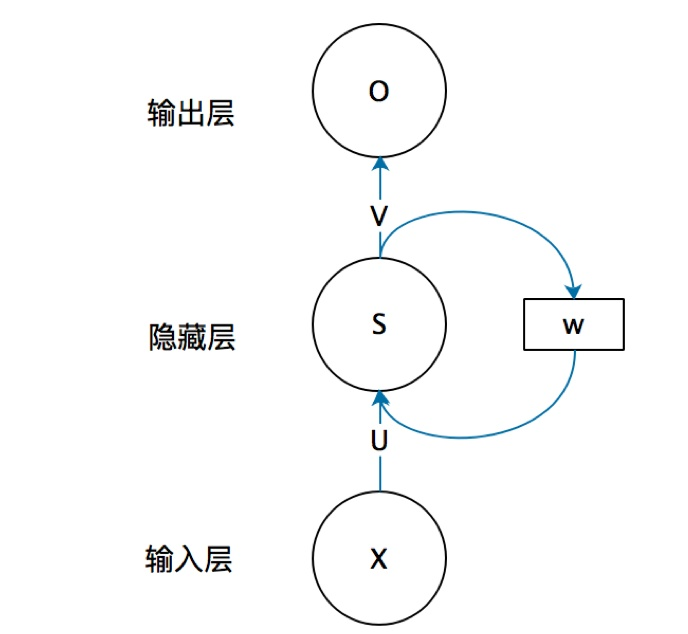
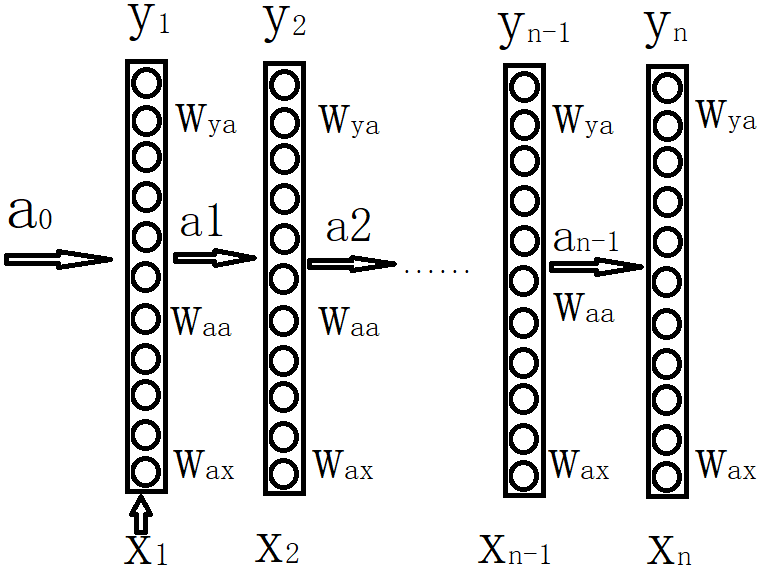

# Chapter06

# RNN

## 1、RNN

### (1)结构

RNN（Recurrent Neural Network循环神经网络）是一类用于处理序列数据的神经网络。

全连接和卷积神经网络，都是处理单个数据的。前一个输入和后一个输入是完全没有关系的。

但是当对一个数据的判断会由前一个的和后一个的数据所左右时，便不能处理了。因为不能接受上一时刻或是下一时刻的数据。也就是说，**对数据的判断，不是仅仅由它的值来决定，而且还要由它的顺序来决定。**即前面的输入和后面的输入是有关系的。

以句子”我爱你“为例，和”你爱我“意思是完全不一样的，这是因为字的顺序导致的。如果将其完整输入到全连接或是卷积中，结果肯定是相同的。

序列化的数据，将第一个数据输入网络后得到一个输出，第一步的激活数值会传递到第二步。依次递推，在每一步，循环神经网络将它的激活数值传递到下一步供其使用。在第0步时，通常是全零作为网络状态。

### (2)RNN展开

$a_{0}$通常设定为全零。$W_{ax}$用于每一步的输入，各层间的连接为$W_{aa}$，$W_{ya}$控制输出预测
$$
a_{t}=g(W_{aa}a_{t-1}+W_{ax}X_{t}+b_{a})
$$

$$
Y_{t}=g(W_{ya}a_{t}+b_{y})
$$

然而RNN的缺点是:

- 它只是用序列中先前的信息来做出预测，而不使用序列中之后的信息。
- 梯度容易消失或爆炸
- 容量有限，对于长序列容易遗忘。

### (3)pytorch实现

$$
h_{t}	
 =tanh(W_{ih}x_{t}+b_{ih}+W_{hh}h_{(t−1)}+b_{hh})
$$

## 2、LSTM

## 3、GRU

## 4、处理手写数字识别