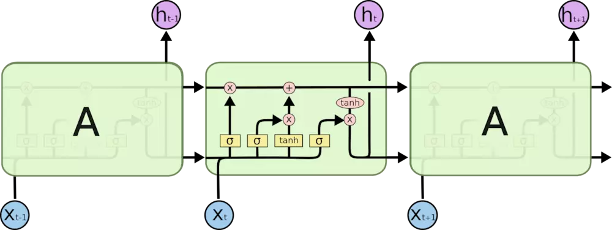
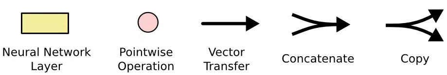
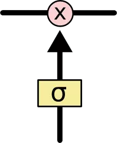
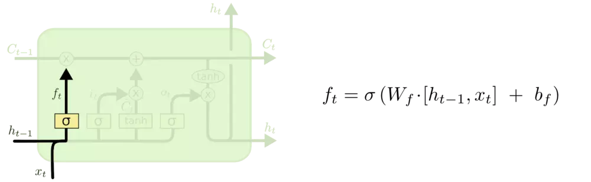
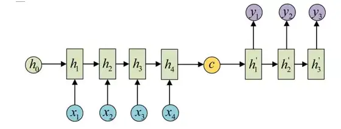
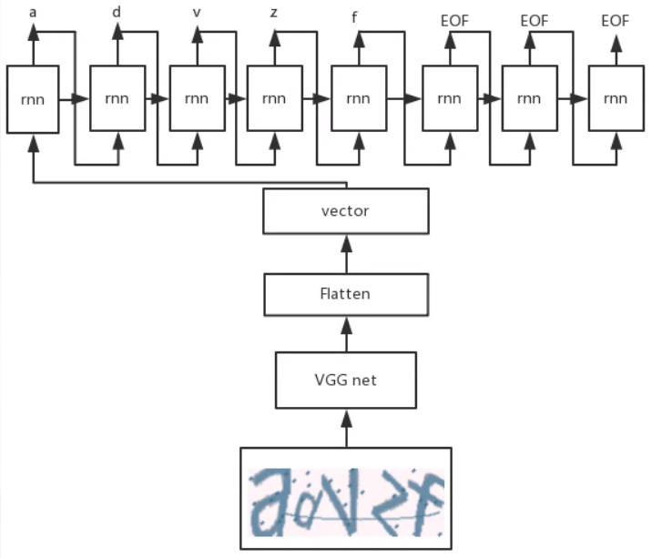
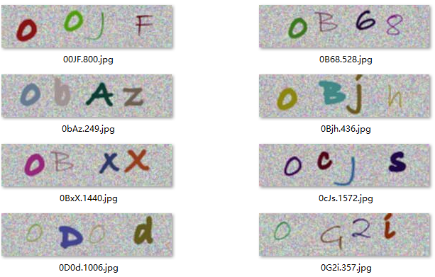
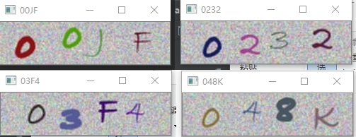
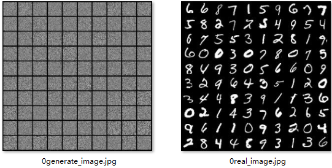
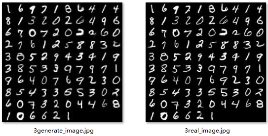

# Chapter06

# RNN

## 1、RNN

### (1)结构

RNN（Recurrent Neural Network循环神经网络）是一类用于处理序列数据的神经网络。

全连接和卷积神经网络，都是处理单个数据的。前一个输入和后一个输入是完全没有关系的。

但是当对一个数据的判断会由前一个的和后一个的数据所左右时，便不能处理了。因为不能接受上一时刻或是下一时刻的数据。也就是说，**对数据的判断，不是仅仅由它的值来决定，而且还要由它的顺序来决定。**即前面的输入和后面的输入是有关系的。

以句子”我爱你“为例，和”你爱我“意思是完全不一样的，这是因为字的顺序导致的。如果将其完整输入到全连接或是卷积中，结果肯定是相同的。


序列化的数据，将第一个数据输入网络后得到一个输出，第一步的激活数值会传递到第二步。依次递推，在每一步，循环神经网络将它的激活数值传递到下一步供其使用。在第0步时，通常是全零作为网络状态。

### (2)RNN展开


$a_{0}$通常设定为全零。$W_{ax}$用于每一步的输入，各层间的连接为$W_{aa}$，$W_{ya}$控制输出预测
$$
a_{t}=g(W_{aa}a_{t-1}+W_{ax}X_{t}+b_{a})
$$

$$
Y_{t}=g(W_{ya}a_{t}+b_{y})
$$

然而RNN的缺点是:

- 它只是用序列中先前的信息来做出预测，而不使用序列中之后的信息。
- 梯度容易消失或爆炸
- 容量有限，对于长序列容易遗忘。


### (3)pytorch实现

每一层的计算方式。
$$
h_{t}	
 =tanh(W_{ih}x_{t}+b_{ih}+W_{hh}h_{(t−1)}+b_{hh})
$$

—$h_{t}$ 是t时刻的隐藏层状态；

—$x_{t}$ 是t时刻的输入；

—$h_{(t−1)}$ 是（t-1）时刻的隐藏层状态或是零初始时刻的初始隐藏状态。

```python
class torch.nn.RNN()
```

参数（Parameters）：

- **input_size** – 输入x中期望的特征数；
- **hidden_size** – 隐藏层状态h的特征数，即输出的特征数；
- **num_layers** – 循环层的数量。例如，设置' num_layers=2 '意味着将两个神经网络堆叠在一起，形成一个堆叠的神经网络，第二个神经网络接收第一个神经网络的输出，并计算最终结果。默认值:1；
- **nonlinearity** – 使用的激活函数。可以是" tanh "或" relu "。默认值:“tanh' '；
- **bias** – 是否使用偏置；
- **batch_first** – 如果“True”，那么输入和输出张量被提供为(batch, seq, feature)。默认值:“假”；
- **dropout** – 如果非零，则在RNN除最后一层外的每一层输出上引入一个丢失层，丢失概率等于“丢失”。默认值:0；
- **bidirectional** – 如果“为真”，则成为双向RNN。默认值:“假”。


输入（Inputs: input, h_0）：

- **input** 形状为 (seq_len序列长度, batch批次, input_size输入尺寸)
- **h_0** of 形状为 (num_layers * num_directions, batch, hidden_size): 包含批处理中每个元素初始隐藏状态的张量。如果不提供，默认为零。如果RNN是双向的，num_directions应该是2，否则应该是1。

返回值：output, h_n：

- **output** 的形状为 (seq_len序列长度, batch批次, num_directions * hidden_size隐藏层尺寸)
- **h_n** of shape (num_layers * num_directions层数, batch批次, hidden_size隐藏层尺寸)

[C6RNN.py](Chapter06/C6RNN.py)

```python
from torch import nn
import torch
rnn = nn.RNN(10,5,3)
input_ = torch.randn(128, 20, 10)
output, hn = rnn(input_)
print(output.shape)
print(hn.shape)
```

结果：

```python
torch.Size([128, 20, 5])
torch.Size([3, 128, 5])
```

### (4)RNN识别手写数字MNIST

构建一个7层的RNN循环神经网络：

```python
class RNNNet(nn.Module):
    def __init__(self):
        super(RNNNet, self).__init__()
        self.rnn_layer = nn.RNN(28, 64, 7, batch_first=True)
        self.classification = nn.Linear(64, 10)
    def forward(self, input_):
        """(N, C, H, W) ===> (N, S, V):(N, 28, 28)"""
        input_ = input_.reshape(-1, 28, 28)
        """output of shape is (N, S, V):(N, 28, 28)"""
        output, hn = self.rnn_layer(input_)
        out = output[:, -1, :]  # 形状变为了（N, V）
        return self.classification(out)
```

训练三轮，在MNIST测试集上的准确度已经达到了94.46%。**循环神经网络同样可以处理图片**

```python
1 loss:0.8632649990922606,acc:0.8823
2 loss:0.31596737467785124,acc:0.9285
3 loss:0.22043649526610812,acc:0.9446
```


## 2、LSTM

长短期记忆网络（Long Short Term Memory networks）

通过刻意设计来避免长期依赖问题。





- 黄色的矩形是学习得到的神经网络层
- 粉色的圆形表示一些运算操作，诸如加法乘法
- 黑色的单箭头表示向量的传输
- 两个箭头合成一个表示向量的连接
- 一个箭头分开表示向量的复制


一个细胞单元（也可认为是一个神经元），水平的这一条线用来传输历史信息。

此外还通过类似 ‘门’ 的结构来选择去除，或是增加信息。包含一个sigmoid神经网络层和一个点乘操作。



LSTM的门：

### (1)遗忘门

通过，此刻的输入，和上一时刻的输出，来决定是否忘记以前的信息。


$$
f_{t} = \sigma(W_{f}\cdot[h_{t-1},x_{t}]+b_{f})
$$
—$h_{t-1}$ 为上一时刻的，细胞的输出；

—$x_{t}$ 为此刻细胞的输入；

—$b_{f}$ 为偏置

—$\sigma$ 为sigmoid激活函数。

经由sigmoid激活，输出为0~1之间的数。1表示 “ 完全保留 ” ，0表示 “ 完全遗忘 ”。

### (2)输入门


$$
i_{t} = \sigma(W_{i}\cdot[h_{t-1},x_{t}]+b_{i})
$$

$$
\widetilde{C}_{t} = tanh(W_{C}\cdot[h_{t-1},x_{t}]+b_{C})
$$

$i_{t}$决定，选择更新内容。

$\widetilde{C}_{t}$创建更新内容的候选。


### (3)输出门


$$
o_{t} = \sigma(W_{o}[h_{t-1},x_{t}]+b_{o})
$$

$$
h_{t} = o_{t}\odot tanh(C_{t})
$$

$o_{t}$ 控制，$\widetilde{C}_{t}+C_{t-1}$的经过激活后的信息有多少输出。$h_{t}$为当前该细胞的输出。

### (4)pytorch实现

```python
class torch.nn.LSTM()
```

参数与RNN类似，其计算公式为：
$$
i_{t} = \sigma(W_{i}\cdot[h_{t-1},x_{t}]+b_{i})\\
f_{t} = \sigma(W_{f}\cdot[h_{t-1},x_{t}]+b_{f})\\
\widetilde{C}_{t} = tanh(W_{C}\cdot[h_{t-1},x_{t}]+b_{C})\\
o_{t} = \sigma(W_{o}[h_{t-1},x_{t}]+b_{o})\\
C_{t} = f_{t}\odot C_{t-1} + i_{t}\odot \widetilde{C}_{t}\\
h_{t} =o_{t}\odot tanh(C_{t})
$$
—$h_{t-1}$ 上一时刻输出

—$x_{t}$  此刻的输入

—$i_{t}$ 输入门的控制

—$f_{t}$ 遗忘门的控制

—$\widetilde{C}_{t}$  待更新的数据

—$o_{t}$ 输出门的控制

—$C_{t}$更新后的记忆

—$h_{t}$ 该细胞的输出

输入数据，

Inputs: input, (h_0, c_0)，如果没有提供(h_0, c_0)，则h_0和c_0都默认为0。

```python
from torch import nn
import torch
lstm = nn.LSTM(64, 128, 7, batch_first=True)
"""输入的形状为（N,S,V）:(128,30,64)"""
input_ = torch.randn(128,30,64)
output_, (h_n, c_n) = lstm(input_)
print(output_.shape)
print(h_n.shape)
print(c_n.shape)
```


## 3、GRU


循环门单元（Gated Recurrent Unit，GRU），由 [Cho, et al. (2014)](https://arxiv.org/pdf/1406.1078v3.pdf)提出。它组合了遗忘门和输入门到一个单独的“更新门”中。

它也合并了cell state和hidden state，并且做了一些其他的改变。结果模型比标准LSTM模型更简单，并且正越来越受欢迎。
$$
r_{t} = \sigma(W_{r}\cdot[h_{t-1},x_{t}])\\
z_{t} = \sigma(W_{z}\cdot[h_{t-1},x_{t}])\\
\widetilde{h}_{t} = tanh(W\cdot[r_{t}\odot h_{t-1},x_{t}])\\
{h}_{t} = (1-z_{t})\odot h_{t-1}+z_{t} \odot \widetilde h_{t}
$$
—$r_{t}$ 用来控制产生新信息需要结合多少过往信息，如果$r_{t}$为零，那么$\widetilde{h}_{t}$仅仅只考虑当前输入的信息；

—$z_{t}$ 用来控制遗忘多少记忆，和控制此时隐藏层的信息$\widetilde{h}_{t}$有多少加入记忆得到输出；

—$\widetilde{h}_{t}$ 为隐藏层的信息

—${h}_{t}$ 为追踪的输出

代码：

```python
class torch.nn.GRU(*args, **kwargs)
```


## 4、SEQ2SEQ

从序列到序列，输入序列，输出也是序列。也叫**编解码结构**

编码器主要负责特征提取；

解码器负责特征还原。



## 5、CNN2SEQ



通过卷积提取特征后，再由循环神经网络输出序列。


## 6、识别验证码



程序自动生成上图验证码，包含了大小写的字母和数字。标签包含于名字中，不区分大小写。

通过4层卷积神经网络提取特征，再在特征图上进行循环神经网络。再通过循环神经网络得到的特征，再经由另一个循环神经网络输出序列，得到所需要的验证码。

```python
def __init__(self):
    super(GRUNet, self).__init__()
    self.con_layer = nn.Sequential(
        nn.Conv2d(3, 16, 3, 1),
        nn.BatchNorm2d(16),
        nn.LeakyReLU(),
        nn.Conv2d(16, 64, 3, 2),
        nn.BatchNorm2d(64),
        nn.LeakyReLU(),
        nn.Conv2d(64, 128, 3, 2),
        nn.BatchNorm2d(128),
        nn.LeakyReLU(),
        nn.Conv2d(128, 256, 3, 2),
        nn.BatchNorm2d(256),
        nn.LeakyReLU()
    )
    self.gru1 = nn.GRU(1536, 512, 3, batch_first=True)
    self.gru2 = nn.GRU(512, 256, 2, batch_first=True)
    self.classification = nn.Linear(256, 36)
```

仅三轮，损失降至：0.005

在测试集上准确度达到了：98.75%



虽然RNN能够处理序列问题，但是其自身提取特征能力并不强。如果网络只由RNN组成，那就连这个验证码识别也是无法完成的，无论网络多深、多广，损失无法训练下降。而一旦加入即使是一层全连接或是一层卷积，就能使得网络能够训练，损失能够下降，能够一定程度识别验证码了。

## 7、自编码

—class Encoder()

—class Decoder()

—class MainNet()

构建一个编码器，将图像压缩为一个特征向量。

然后再由构建的解码器将特征向量还原出来，和原图做损失。





经过三轮训练，就能输出和原图几乎一致的图像了。


## 8、反卷积

$$
H_{out} = (H_{in} - 1) \times \text{stride} - 2 \times \text{padding} +\\ \text{dilation}\times (\text{kernel_size} - 1) + \text{output_padding} + 1
$$

该公式可由卷积公式反推出来。


本质还是卷积过程。

在进行**反卷积的**时候设置的**stride**并**不是指反卷积在进行卷积时候卷积核的移动步长，而是被卷积矩阵填充的padding。**

通过反卷积将卷积提取的特征还原回原图。


还原效果。