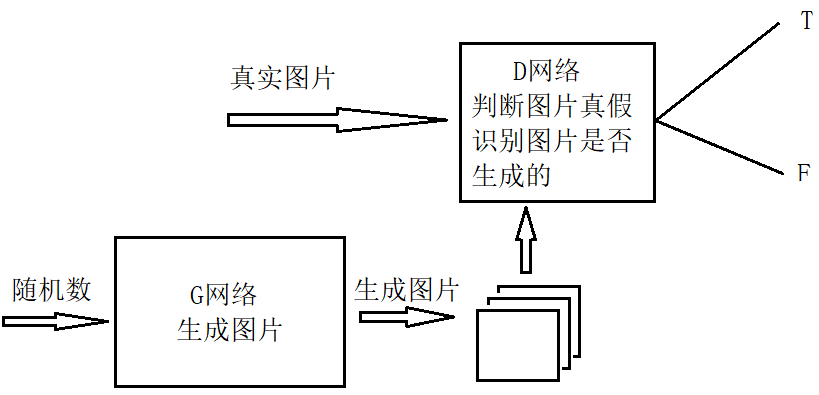

# Chapter07

# Gan(生成式对抗网络)

编解码结构，将解码器单独拿出来，输入随机数并不能生成图片。因为并不知道特征分布如何。

VAE变分自编码,虽然不知道特征分布如何，但是假定其为标准正太分布，然后让其不断地靠近真实分布。然而该假定并不合适，故效果不佳，周边特征模糊。

## 1、Gan(生成式对抗网络)

输入一串从正太分布采样的随机数进入生成网络（G网络），生成图片。

然后输入真实图片和生成的图片进入判别网路（D网络），判断哪些图片是真实的，哪些图片是生成的。

生成网络（G网络）要不断地使生成的图片，经由判定网络判定为正。

而判别网络（D网路）要不断地辨别哪些图片是生成的，哪些是真实的。

由反向传播学习。

GAN所建立的一个学习框架，实际上就是生成模型和判别模型之间的一个模仿游戏。生成模型的目的，就是要尽量去模仿和学习真实数据的分布；判别模型则是要判别自己所得到的一个输入数据，究竟来自于真实的数据分布还是来自于一个生成模型。

然而任意一个网络能力过强，则无法训练。

同时训练时采样自何分布，使用时也应采样该分布生成图像。

## 2、GAN的优缺点

优点：

- GAN是一种生成模型，相比其他生成模型（玻尔兹曼机和GSNs）只用到了反向传播，而不需要复杂的马尔科夫链接
- 相比其他所有模型，GAN可以产生更加清晰、真实的样本
- GAN采用的是一种无监督的学习方式训练，可以被广泛用在无监督学习和半监督学习领域
- 相比于变分自编码器，GANs没有引入任何决定性偏置，变分方法引入决定性偏置，因为他们优化对数似然的下界，而不是似然度本身，则看起来导致了VAEs生成的实例比GANs更模糊
- 相比VAE，GANs没有变分下界，如果鉴别器训练良好，那么生成器可以完美的学习到训练样本的分布。换句话说，GANs是渐进一致的，但是VAE是有偏差的。
- GAN应用到一些场景三，比如图片风格迁移，超分辨率，图像补全，去噪，避免了损失函数设计的困难，不管三七二十一，只要有一个基准，直接上判别器，剩下的就交给对抗训练了。

缺点：

- 训练GAN需要达到纳什均衡，有时候可用梯度下降法做到，有时候做不到
- GAN不适合处理离散形式的数据，比如文本
- GAN存在训练不稳定、梯度消失、模式崩溃问题
- 如果某一次G网络生成的样本可能并不是很真实，但是D网络给出了正确的评价，或者是G网络生成的结果中一些特征得到了D的认可，这时候G就好认为自己输出的是正确的，那么接下来就这样输出肯定D网络还会给出比较高的评价，实际上G生成的并不怎么样，但是他们两个就这样自我欺骗下去了，导致最终生成结果缺少一些信息，特征不全。

## 3、CGAN

条件生成式对抗网络，生成器和判别器都增加额外信息Y为条件，Y可以是任意信息，例如类别信息，或者其他模态的数据。通过将额外信息输送给判别模型和生成模型，作为输入层的一部分，从而实现条件生成式对抗网络。在生成模型中，先验输入噪声和条件信息Y联合组成联合隐层表征。条件GAN是带有条件概率的二人极小极大值博弈。

## 4、DCGAN

将GAN中的全连接，全部使用卷积，判别器几乎是和生成器对称的，同时没有池化层，使用了反卷积并且步长大于等于2进行上采样。

- G网络中取消所有池化层，使用反卷积并且步长大于等于2进行上采样。
- D网络中也用stride的卷积代替池化
- 生成器G和判别器D中几乎每一层都使用batchnorm层，将特征层的输出归一化到一起，加速了训练，提升训练的稳定性（生成器的最后一层和判别器的第一层不加batchnorm），这是为了保证模型学到正确的均值方差。
- D网络中使用leakrelu激活函数，而不是RELU，防止梯度稀疏，G网络中仍然采用relu，但是输出层采用tanh激活。

### 训练细节：

1. 预处理，将图像归一化到[-1,1]之间；
2. 所有参数的初始化，有（0,0.02）的正太分布随机得到；
3. LeakyReLU()的斜率在0.2，不使用池化
4. 优化器使用调好超参的Adam优化器，学习率 = 0.0002
5. 可以将betas调整为（0.5,0.999），防止震荡和不稳定（不明显）
6. 去掉sigmoid()激活

## 5、WGAN

主要改进损失函数

- 判别器最后一层去掉sigmoid
- 生成器和判别器的loss不取log
- 对更新后的权重强制阶段到一定范围，如[-0.01,0.01]
- 推荐使用SGD、RMSprop等优化器，不使用基于动量的优化算法。

## 6、WGAN-GP

改进连续性限制条件，将权重剪切到一定范围。

但会造成权重大多分布在两个极端上，浪费了拟合能力

