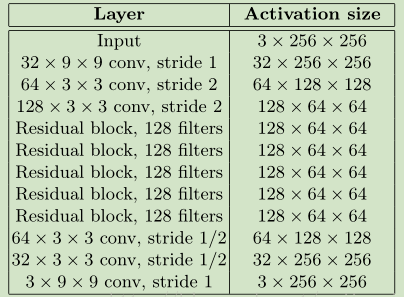

# Fast Neural Style Transfer

# 1、简介

在[原始风格迁移](https://blog.csdn.net/weixin_48866452/article/details/109045157)中，是以一张图片作为参数来训练它。

生成一张图片则需要数分钟不等的时间。

如果以网络来转换图片，我们训练这个网络，那么则能够快速的将图片进行风格转换，而无需迭代一张图片数百至千次。


于是我们所需要做的则是定义这个风格转换网络。


# 2、网络定义



网络结构如上。类似于自编码解构，先压缩图片，再还原回来。

此外，网络的上采样，采用的是先放大图片再卷积的形式，而非反卷积。

于是构建出网络：

```python
class ResBlock(nn.Module):

    def __init__(self,c):
        super(ResBlock, self).__init__()
        self.layer = nn.Sequential(
            nn.Conv2d(c,c,3,1,1, bias=False),
            nn.InstanceNorm2d(c),
            nn.ReLU(),
            nn.Conv2d(c, c, 3, 1, 1, bias=False),
            nn.InstanceNorm2d(c),

        )
        self.relu = nn.ReLU()

    def forward(self, x):
        return self.relu(self.layer(x)+x)

class TransNet(nn.Module):

    def __init__(self):
        super(TransNet, self).__init__()
        self.layer = nn.Sequential(
            nn.Conv2d(3, 32, 9, 1, 4, bias=False),
            nn.InstanceNorm2d(32),
            nn.ReLU(),
            nn.Conv2d(32,64,3,2,1, bias=False),
            nn.InstanceNorm2d(64),
            nn.ReLU(),
            nn.Conv2d(64, 128, 3, 2, 1, bias=False),
            nn.InstanceNorm2d(128),
            nn.ReLU(),
            ResBlock(128),
            ResBlock(128),
            ResBlock(128),
            ResBlock(128),
            ResBlock(128),
            nn.Upsample(scale_factor=2, mode='nearest'),
            nn.Conv2d(128,64,3,1,1, bias=False),
            nn.InstanceNorm2d(64),
            nn.ReLU(),
            nn.Upsample(scale_factor=2, mode='nearest'),
            nn.Conv2d(64, 32, 3, 1, 1, bias=False),
            nn.InstanceNorm2d(32),
            nn.ReLU(),
            nn.Conv2d(32,3,9,1,4),
            nn.Sigmoid()
        )

    def forward(self, x):
        return self.layer(x)
```

数据集使用COCO数据集来进行网络的训练。


相较于一张[图片迭代](https://blog.csdn.net/weixin_48866452/article/details/109045157)的，风格损失改为带批次的：

```python
def get_gram_matrix(f_map):
    n, c, h, w = f_map.shape
    f_map = f_map.reshape(n, c, h * w)
    gram_matrix = torch.matmul(f_map, f_map.transpose(1, 2))
    return gram_matrix
```


使用VGG16作为损失网络：

```python
class VGG16(nn.Module):
    def __init__(self):
        super(VGG16, self).__init__()
        a = vgg16(True)
        a = a.features
        self.layer1 = a[:4]
        self.layer2 = a[4:9]
        self.layer3 = a[9:16]
        self.layer4 = a[16:23]
	
    """输出四层的特征图"""
    def forward(self, input_):
        out1 = self.layer1(input_)
        out2 = self.layer2(out1)
        out3 = self.layer3(out2)
        out4 = self.layer4(out3)
        return out1, out2, out3, out4
```


# 3、训练网络

加载风格图片、实例化网络、实例化转换网络、加载模型参数、实例化优化器、实例化损失函数、实例化数据集、计算风格图片的格拉姆矩阵。

进入训练主循环，训练风格转换网络。

```python
image_style = load_image('hosizora.jpg').cuda()
vgg16 = VGG16().cuda()
t_net = TransNet().cuda()
# g_net.load_state_dict(torch.load('fst.pth'))
optimizer = torch.optim.Adam(g_net.parameters())
loss_func = nn.MSELoss().cuda()
data_set = COCODataSet()
batch_size = 2
data_loader = DataLoader(data_set, batch_size, True, drop_last=True)

"""计算分格,并计算gram矩阵"""
s1, s2, s3, s4 = vgg16(image_style)
s1 = get_gram_matrix(s1).detach().expand(batch_size,s1.shape[1],s1.shape[1])
s2 = get_gram_matrix(s2).detach().expand(batch_size,s2.shape[1],s2.shape[1])
s3 = get_gram_matrix(s3).detach().expand(batch_size,s3.shape[1],s3.shape[1])
s4 = get_gram_matrix(s4).detach().expand(batch_size,s4.shape[1],s4.shape[1])
j = 0
while True:
    for i, image in enumerate(data_loader):
        """生成图片，计算损失"""
        image_c = image.cuda()
        image_g = t_net(image_c)
        out1, out2, out3, out4 = vgg16(image_g)
        # loss = loss_func(image_g, image_c)
        """计算风格损失"""
        loss_s1 = loss_func(get_gram_matrix(out1), s1)
        loss_s2 = loss_func(get_gram_matrix(out2), s2)
        loss_s3 = loss_func(get_gram_matrix(out3), s3)
        loss_s4 = loss_func(get_gram_matrix(out4), s4)
        loss_s = loss_s1+loss_s2+loss_s3+loss_s4

        """计算内容损失"""
        c1, c2, c3, c4 = vgg16(image_c)

        # loss_c1 = loss_func(out1, c1.detach())
        loss_c2 = loss_func(out2, c2.detach())
        # loss_c3 = loss_func(out3, c3.detach())
        # loss_c4 = loss_func(out4, c4.detach())

        """总损失"""
        loss = loss_c2 + 0.000000008 * loss_s

        """清空梯度、计算梯度、更新参数"""
        optimizer.zero_grad()
        loss.backward()
        optimizer.step()
        print(j, i, loss.item(), loss_c2.item(), loss_s.item())
        if i % 100 == 0:
            torch.save(g_net.state_dict(), 'fst.pth')
            save_image([image_g[0], image_c[0]], f'D:/data/chapter7/{i}.jpg', padding=0, normalize=True,
                       range=(0, 1))
            j += 1
```

可以调整不同的分格损失和内容损失系数，来达到不同的效果。但是这个效果较难控制。

以下展示的是训练星空的风格的快速转换效果。


# 4、效果

