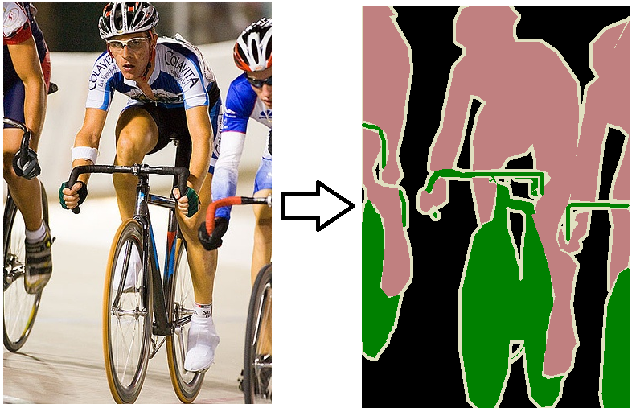
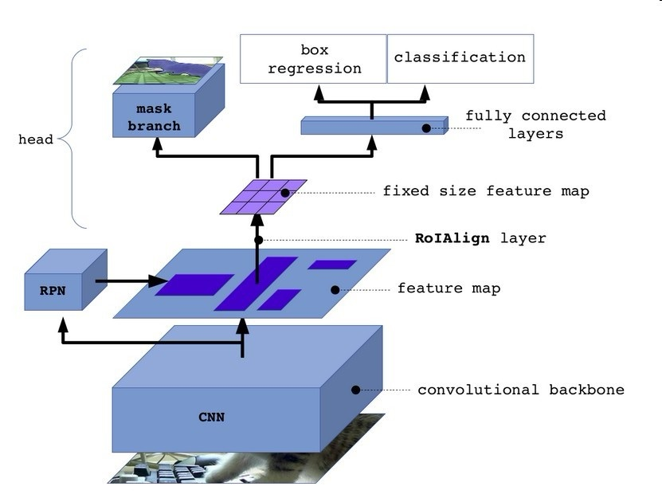
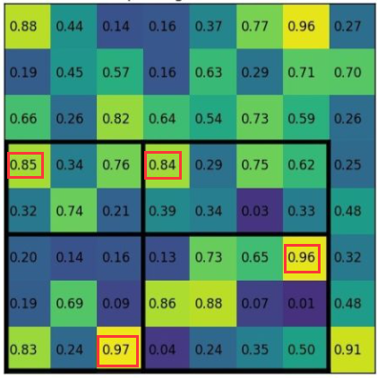
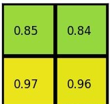
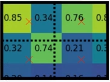
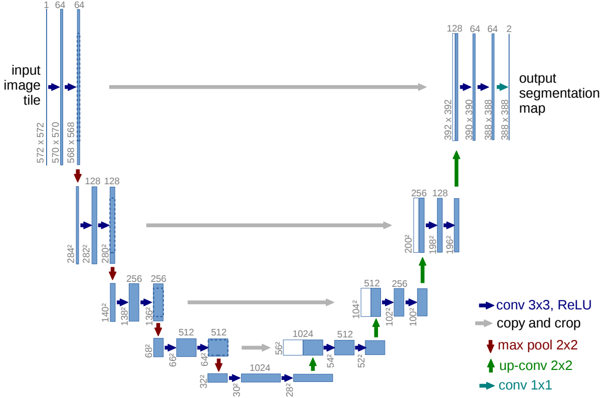
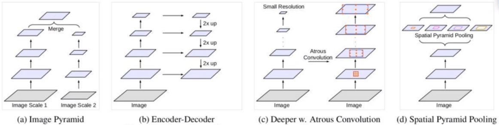
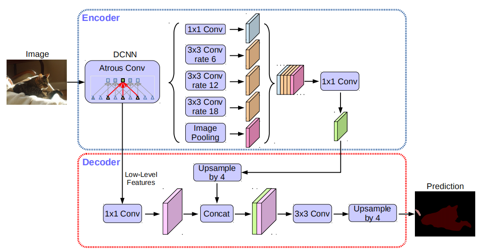

# Chapter08

## 图像分割

## 1、图像分割

给一张图片，识别出图像中的内容，区分出其中的物体属于哪一类。

做法便是对每一个像素进行分类。

应用于抠图、自动驾驶、医疗图像等。

图像分割大致分为三类：

- 普通分割：将不同分属不同物体的像素区域分开。比如前景和背景分割开，狗的区域和猫的区域与背景分割开。
- 语义分割：在普通分割的基础上，分类出每一块区域的语义（即这块区域是什么物体）。如把画面中的所有物体都指出他们各自的类别。
- 实例分割：在语义分割的基础上，给每一个物体编号。如这个是该画面中的狗A，那个是画面中的狗B。

# 2、网络

## （1）FCN（Fully Convolutional Networks）

图片经过全卷积结构，卷为16X16大小的特征图，再上采样至34X34、70X70、500X500，中间路由浅层信息（Concat）。

效果一般，池化带来的负面效应。

## （2）Mask RCNN

Mask R-CNN是何凯明力作，将目标侦测（Object Detection）和像素分类（Semantic Segmentation）合在一起。

1. 神经网络有了多个分支输出。Mask RCNN使用类似Faster RCNN的框架，Faster RCNN的输出是物体的回归框（Bounding Box）和类别，而Mask RCNN则多出一个分支，用来预测物体的语义分割图。也就是说神经网络同时学习两项任务，可以相互促进。
2. 在语义分割中使用Binary Mask。原来的语义分割预测类别需要使用0、1、2、3、4等数字代表各个类别。在Mask RCNN中，检测分支会预测类别。这时候分割只需要使用0、1预测这个物体的类别即可。
3. 在Mask RCNN提出了RoiAlign用来替换Faster RCNN中的RoiPooling。RoiPooling的实现是讲输入图像中任意一块区域对应到神经网络特征图中的对应区域。RoiPooling使用化整的近似来寻找对应的区域，导致对应关系与实际情况有所偏移。这在分类任务中可以容忍，但对于精细度更高的达到像素级别分类的图像分割则影响较大。

RoiAlign则是将图像均匀分块，再取平均来表达中心点。相比池化，削弱了偏移。但不具有可学习参数。

## （3）UNet

图片先下采样，再上采样，有浅层的特征图进行路由，最后输出目标图。

结构类似编解码结构。

#### （4）UNet++

连接相比UNet连接更加稠密

## （5）U2Net

由UNet构建一个模块，再构建网络。

### （6）DeepLab

1. Image Pyramid：将输入图片缩放成不同比例，分别应用在全卷积（DCNN）上，将预测结果融合得到最终输出。
2. Encoder-Decoder：利用Encoder阶段的多尺度特征，运用到Decoder阶段上恢复空间分辨率，代表工作有FCN、SegNet、PSPNet等。
3. Deeper W.Atrous Convolution：在原始模型的顶端增加额外的模块，例如DenseCRF，捕捉像素间的长距离信息。
4. Spatial Pyramid Pooling：空间金字塔池化具有不同采样率和多种视野的卷积核，能够以多尺度捕捉对象。

将以上模块组合为DeepLab网络：

# 3、语义分割基本方法

1. 下采样和上采样：Convolution + Deconvolution/Rsize
2. 多尺度特征融合：特征逐点相加、特征通道维度拼接。
3. 获得像素级别的Segement Map：对每一个像素点进行类别判断。

