# Chapter09

# 强化学习

## 1、深度强化学习重要模型


现行AI，只是基于统计的，只在感知层面，具有感知能力。

而强化学习，能进行逻辑层面，具备主动规划能力。

强化学习分为无模型和有模型，主要是是否已知当前规则。AlphaGo、AlphaZero、AlphaMuzero则是最好的代表，已知游戏规则。

无模型（Model-Free RL），不知道明确规则的情况下，进行训练。

在无模型下，由分为基于策略梯度（Policy Optimization）和价值矩阵的Q学习（Q-Learning）。

现行的是讲策略梯度和Q学习进行了结合，有A3C。

用得最多的为DDPG。


主要由[DeepMind](https://www.deepmind.com/)和OpenAI推动强化学习。


一个代理人（Agent）存在一个空间中，并观察环境，得到该环境的状态，于是做出一个动作，一旦发出了动作则会改变环境，环境的改变则产生一个反馈给代理人，反馈有好有坏。

强化学习是，让代理人在该环境中生存。不断地试错，以试图获取最大的回报。


## 2、马尔科夫链

马尔可夫链(Markov chain)，又称离散时间马尔可夫链（discrete-time Markov chain），为**离散的序列链条**，因俄国数学家安德烈·马尔可夫（俄语：Андрей Андреевич Марков）得名，为状态空间中经过从一个状态到另一个状态的转换的随机过程。

该过程要求具备“无记忆”的性质：**下一状态的概率分布只能由当前状态决定**，在时间序列中它前面的事件均与之无关。
$$
P(x_{t}|x_{t-1},x_{t-2},...,x_{t-n})=P(x_{t}|x_{t-1})
$$
在马尔可夫链的每一步，系统根据概率分布，可以从一个状态变到另一个状态，也可以保持当前状态。**状态的改变叫做转移**，与不同的状态改变相关的概率叫做**转移概率**。随机漫步就是马尔可夫链的例子。随机漫步中每一步的状态是在图形中的点，每一步可以移动到任何一个相邻的点，在这里移动到每一个点的概率都是相同的（无论之前漫步路径是如何的）。


既然某一时刻状态转移的概率只依赖前一个状态，那么只要求出系统中任意两个状态之间的转移概率，这个马尔科夫链的模型就定了。

## 3、贝尔曼方程

$$
R_{t} = r_{t} + \gamma r_{t+1} + \gamma^{2}r_{t+2}+...+\gamma^{n}r_{t+n}
$$

$$
R_{t} = r_{t} + \gamma( r_{t+1} + \gamma (r_{t+2}+...))=r_{t}+\gamma R_{t+1}
$$


有马尔科夫链知，下一时刻的状态，由当前时刻的状态和当前时刻的动作产生。

但是当前状态的多种动作，如何选择。

动作的发出，会产生环境状态的改变，同时给出回报。

由于当前回报并非是我们所需要的最终目标。

比如围棋中的倒脱靴，在对方提掉自己的数子后，再反过来叫吃，擒住对方数子。

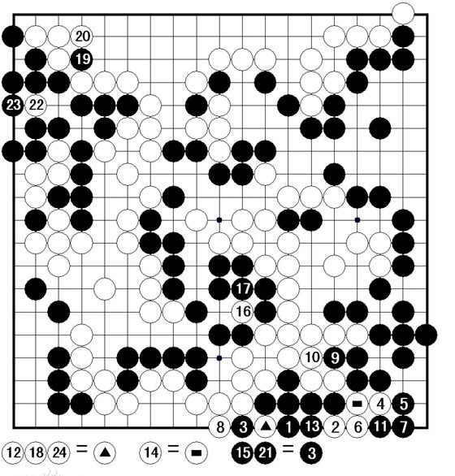

在如图的例子中，白8提掉黑四子后，黑棋第九手走到△的位置上，反吃掉白三子，成为活棋。

即是先得到负回报，然后在得到极大的回报。故需要看到未来的一个回报，而非仅仅眼前的利益（当前的正回报可能会造成最终的负回报，输掉整盘棋）。


但未来的事情尚未发生，又该如何考虑。另外过多考虑未来的不稳定的事情，造成前期的崩溃。

定义R为最终的参考回报，$r_{t}$为立即回报。于是R应该等于当前时刻的立即回报，同时要加上下一时刻、下下时刻、......、一直到最终。
$$
R_{t} = r_{t} + r_{t+1} + r_{t+2}+...+r_{t+n}
$$
同时未来的回报不确定，故需要加上一个衰减的系数，

则变为了：
$$
R_{t} = r_{t} + \gamma r_{t+1} + \gamma^{2}r_{t+2}+...+\gamma^{n}r_{t+n}
$$
此为**贝尔曼方程**，也称价值方程。

$\gamma$ 取值0~1。

$\gamma$取0的话，就是过分短视，只参考当前回馈，就如认为世事无常及时行乐的人。

$\gamma$取1的话，则是过分考虑长远，而不顾当前回馈的恶化，导致无法抵达遥远未来。

则未来离得越远，则参考的价值越小，除非未来的回报足够大。


R能求解出来吗？在未来不确定情况下，无法计算，是无解的。

但未来可期，可通过其期望来求解。虽然每一个回报是不稳定的，但是期望是稳定的。

则：
$$
V = E(R_{t})
$$
回报的期望，为价值。

于是网络则是让输出的回报不断地靠近价值。


## 4、Q函数


$$
Q(s,a) = r + \gamma max_{a^{'}}Q(s^{'},a^{'})
$$
要计算当前的价值，需计算立即回报和未来的回报的最大和。

计算当前状态选择的一个动作会产生的价值，为该状态、动作产生的回报，加上未来最优的动作回报。

为了知道未来的回报，故需要多种选择都试验。


一个小游戏，机器人随机放置在任意房间里，标识为0、1、2、3、4。现在需要走出外界，标识为5。

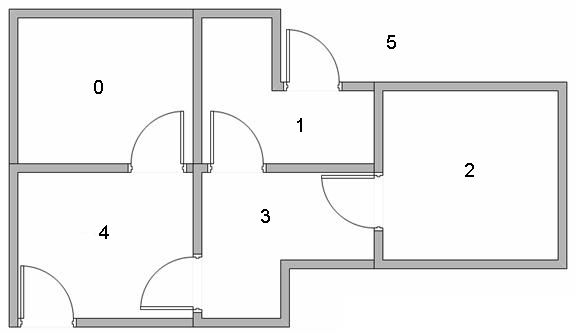


将每一个房间标识为一个节点。可以画出状态转移图形为：

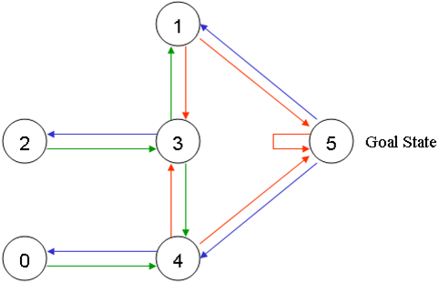

于是标识上奖励：

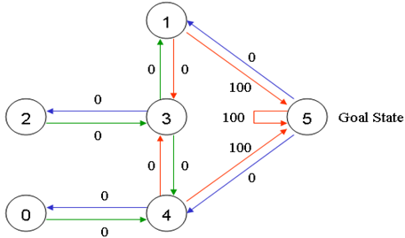

只有当走出房间的时候，才给出100的回报。


于是写为矩阵，为：

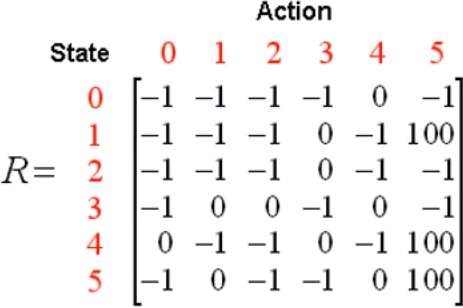

我们需要计算出每一个状态下，对应的每一种行动的价值，但是在未知的情况下，需要从零矩阵开始优化。

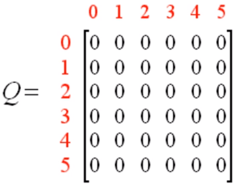

通过公式：
$$
Q(s_{t},a) = R(s_{t},a) + \gamma max(Q(s_{t+1},a_{1},a_{2},a_{3},...,a_{n}))
$$
即更新当前状态选择的当前动作的价值时，等于此时的回报（当前状态选择的当前动作的回报）加上价值矩阵中的转移至下一状态的最大价值。

于是定义回报矩阵和价值矩阵：

```python
import numpy as np
import random

# 初始化矩阵
Q = np.zeros((6, 6))
# Q = np.array(Q)

# 回报矩阵R
R = np.array([[-1, -1, -1, -1, 0, -1],
              [-1, -1, -1, 0, -1, 100],
              [-1, -1, -1, 0, -1, -1],
              [-1, 0, 0, -1, 0, -1],
              [0, -1, -1, 0, -1, 100],
              [-1, 0, -1, -1, 0, 100]])
```

定义未来远见系数为0.8：

```python
gamma = 0.8
```

开始不断迭代，求解**价值矩阵Q**。

```python
"""迭代"""
for i in range(20000):
    """对每一次迭代,随机选择一种状态作为初始"""
    state = random.randint(0, 5)
    while True:
        """选择当前状态下的所有可能动作"""
        r_pos_action = []
        for action in range(6):
            if R[state, action] >= 0:
                r_pos_action.append(action)

        """随机选择一个可以行动的动作"""
        next_state = r_pos_action[random.randint(0, len(r_pos_action) - 1)]

        """更新Q矩阵，通过当前状态，下一状态，该动作的回报，和该状态转移的价值。"""
        Q[state, next_state] = R[state, next_state] + gamma * (Q[next_state]).max()
        state = next_state
        """游戏最大可行动次数，达到即结束"""
        if state == 5:
            break
Q = Q.astype(np.int)
print((Q/Q.max()*100).astype(np.int))
```

于是得到矩阵：

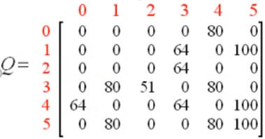

这样便得到每一步的价值，于是遵循价值矩阵则很容易完成任务，走出房间了。

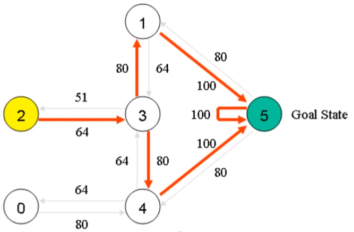

但这只能解决状态有限，动作有限的问题。因为Q矩阵有明确的大小限制，只要有一样无线，则不能使用。


## 5、DQN

在玩游戏中，每一帧的画面都是不同的，不可能穷举完。但动作是有限的。

我们可以使用神经网络来代替Q矩阵。神经网络是万能的函数逼近器，只要足够大，能逼近任意函数。

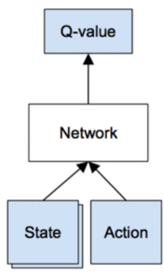

Q矩阵的目的，是为了得到每一节点的，该动作的价值。

按照上图网络图，传入状态、动作，即可得到该动作状态的价值。但也有缺点动作较多的时候，需要输入多次。

如果动作有限的时候，可以使用下面网络结构：

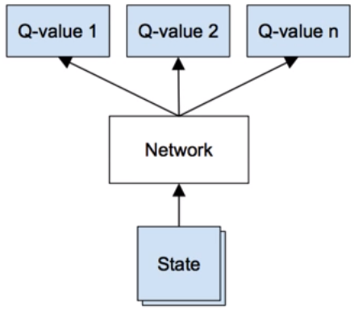

给网络传入状态，得到每一个动作的价值。


## 6、AI玩CartPole游戏

[gym](http://gym.openai.com/)平台上提供强化学习的游戏。

```python
pip install gym
```

CMD中安装gym

```python
import gym

"""加载游戏"""
env = gym.make('MountainCar-v0')
for i_episode in range(20):

    """游戏初始化"""
    observation = env.reset()
    for t in range(100000):
        """显示游戏"""
        env.render()
        
        """从动作空间随机采样"""
        action = env.action_space.sample()
        
        """动作一步，返回环境，回报，游戏是否结束，信息"""
        observation_, reward, done, info = env.step(action)
        print(observation,action, reward, observation_, done)
        if done:
            print("Episode finished after {} timesteps".format(t + 1))
            break
env.close()
```

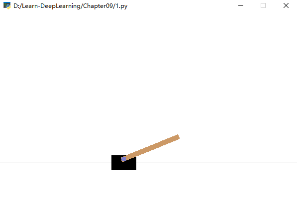

如此玩游戏。输出环境状态为二维向量，动作也为数为二，则可使用全连接神经网络。


首先构建一个神经网络：

```python
class DQNet(nn.Module):

    def __init__(self, num_state, num_actions):
        """
        初始化网络
        :param num_state: 输入状态数
        :param num_actions: 输出行为数
        """
        super(DQNet, self).__init__()
        self.layer = nn.Sequential(
            nn.Linear(num_state, 64),
            nn.LeakyReLU(),
            nn.Linear(64, 128),
            nn.LeakyReLU(),
            nn.Linear(128, 256),
            nn.LeakyReLU(),
            nn.Linear(256, num_actions)
        )

    def forward(self, input_):
        return self.layer(input_)
```


然后构建我们的训练器。首先是类的初始化。然后如何训练网络？
$$
Q(s_{t},a) = R(s_{t},a) + \gamma max(Q(s_{t+1},a_{1},a_{2},a_{3},...,a_{n}))
$$
根据公式，我们需要当前状态、当前操作、回报、下一时刻的操作、下一时刻的价值。让网络输出的价值去逼近下一状态的价值加上此刻的回报的和。

```python
class Trainer(object):

    def __init__(self):
        """初始化类"""
		pass
    
    def __call__(self):
        """玩游戏，训练网络"""
        self.is_render = False  # 控制是否展示游戏画面
        self.ave = 0
        while True:
            self.__try_play()
            self.__train()
    
    def __try_play(self):
        """试玩"""
        pass
    
    def __train(self):
        """训练网络"""
        pass

    def play(self):
        """游玩游戏"""
        pass
```


首先是类的初始化函数。定义了几个参数，经验池的尺寸，探索系数，远见系数，是否启用cuda训练。

使用经验池的因素，是为了训练网络。一般训练网络时，都会采用多个批次进行训练，效果会比较好，收敛更快。所以增加一个经验池，经验池的内容为[状态，动作，回报，下一状态]。经验池的尺寸上限，是为了能够排去那些陈旧的经验，不再让网络学习。

```python
def __init__(self, experience_pool_size, explore=0.8, foresight=0.9, is_cuda=True):
    self.device = torch.device('cuda:0' if is_cuda and torch.cuda.is_available() else 'cpu')

    """加载《倒杆杆游戏》"""
    self.game = gym.make('CartPole-v1')

    """定义网络远系数、探索系数、经验池、经验池尺寸"""
    self.foresight = foresight
    self.explore = explore
    self.experience_pool = []
    self.experience_pool_size = experience_pool_size

    """实例化网络、损失函数、优化器"""
    self.q_net = DQNet(num_state=4, num_actions=2).to(self.device)
    self.optimizer = torch.optim.Adam(self.q_net.parameters())
    self.loss_func = nn.MSELoss().to(self.device)
```


于是首先便是让网络先玩游戏，累计经验后再行训练学习，编写试玩部分代码：

```python
    def __try_play(self):
        """游戏初始化，并获取初始状态。这里是开始一局游戏。"""
        state_t = self.game.reset()
        R = 0
        """游戏循环，循环游戏的每一帧"""
        while True:

            """如果要展示游戏画面，则展示"""
            if self.is_render:
                self.game.render()

            """
            如果经验池没满，则先随机动作，充分试错，添加经验；
            否则，则通过网络通过预测的价值来选择动作。
            """
            if len(self.experience_pool) <= self.experience_pool_size:
                action = self.game.action_space.sample()

            else:
                """弹出一条经验值，"""
                self.experience_pool.pop(0)
                self.explore += 1e-4

                """随机选择，看是否需要探索，否则由网络输出动作"""
                if random.random() > self.explore:
                    action = self.game.action_space.sample()
                else:
                    _state_t = torch.tensor(state_t, dtype=torch.float32).unsqueeze(0).to(self.device)
                    action = self.q_net(_state_t.to(self.device))
                    """根据最大价值，选择相应操作动作"""
                    action = torch.argmax(action.squeeze(0)).item()

            """执行动作，获取回报和下一状态"""
            state_t_plus_1, reward, done, info = self.game.step(action)

            """累加回报，活的越久，所产生的回报则越大"""
            R += reward
            
            """向经验池增加经验"""
            self.experience_pool.append([state_t, R, action, state_t_plus_1, done])
            state_t = state_t_plus_1
            if done:
                self.ave = 0.95 * self.ave + 0.05 * R
                print(self.ave, R)
                if self.ave >= 300:
                    self.is_render = True
                    torch.save(self.q_net.state_dict(), 'q_net_CartPole.pth')
                break
```

接着便是训练：

```python
def __train(self):
    """训练过程"""
    if len(self.experience_pool) > self.experience_pool_size:
        """从经验池、获取经验"""
        states, values, actions, states_next, dons = self.get_experience()

        """得到当前状态的估计值"""
        valuations = self.q_net(states)
        valuation = torch.gather(valuations, dim=1, index=actions)

        """得到下一状态的估计值，并选择最大的估值"""
        valuations_next = self.q_net(states_next).detach()
        valuations_max = torch.max(valuations_next, dim=1, keepdim=True)[0]

        """当前状态的目标估值按照Q函数计算"""
        target = values + (1 - dons) * valuations_max * self.foresight
        
        """计算损失、优化"""
        loss = self.loss_func(valuation, target.detach())
        self.optimizer.zero_grad()
        loss.backward()
        self.optimizer.step()
```

游玩游戏结果：

```python
def play(self, frequency):
    self.q_net.load_state_dict(torch.load('q_net_MountainCar.pth'))
    for i_episode in range(frequency):
        observation = self.game.reset()
        point = 0
        while True:
            """显示游戏"""
            self.game.render()
            action = torch.argmax(action.squeeze(0)).item()
            observation_, reward, done, info = self.game.step(action)
            point += reward
            observation = observation_
            if done:
                print('Game over.You cost time:', point)
                break
```


