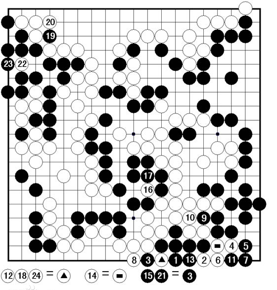
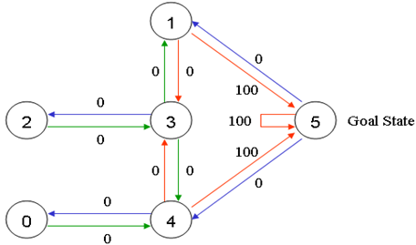
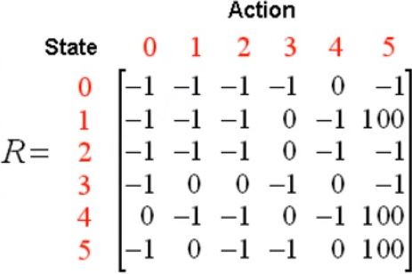
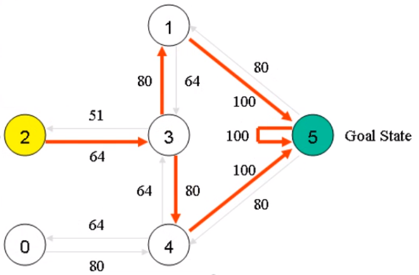
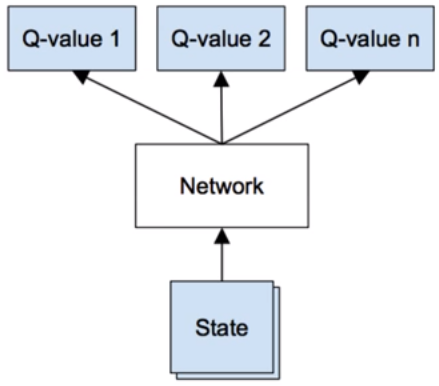
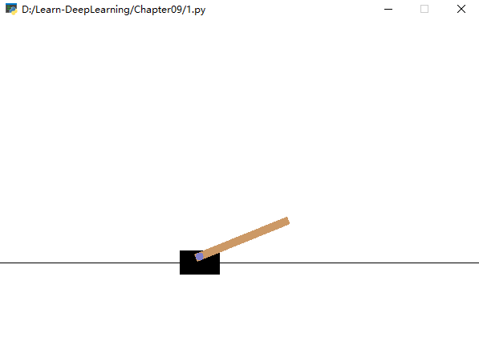

# 强化学习DQN并玩CartPole游戏

# 1、强化学习


一张经典的关于强化学习的图。

一个代理（Agent）存在一个空间中，并观察环境，得到该环境的状态（observation），于是做出一个动作（action），一旦发出了动作则会改变环境，环境的改变则产生一个回报（reward）给代理，回报有正有负、有大有小。

强化学习是，让代理在该环境中生存。不断地试错，以试图获取最大的回报。

这便是强化学习的过程。


# 2、马尔科夫链

在代理不断地观察环境做出动作得到回报，观察环境做出动作得到回报，......，观察环境做出动作得到回报中。

这是一步一步的离散的动作着的，于是构成了一条马尔可夫链。

马尔可夫链(Markov chain)，又称离散时间马尔可夫链（discrete-time Markov chain），为**离散的序列链条**，为状态空间中经过从一个状态到另一个状态的转换的随机过程。

不过马尔科夫链要求具备“无记忆”的性质：**下一状态的概率分布只能由当前状态决定**，在时间序列中它前面的事件均与之无关。
$$
P(x_{t}|x_{t-1},x_{t-2},...,x_{t-n})=P(x_{t}|x_{t-1})
$$
即从状态$x_{t-1}$转移到状态$x_{t}$的概率，只和上一状态$x_{t-1}$有关，而和之前的没有关系。


# 3、贝尔曼方程

那么在一个状态到另一状态的转变过程中，应该选择什么样的动作呢?

我们可以预测回报的多少来进行决策，选择那一个动作，即那一动作回报多则选择那一动作。

但是当前的回报并非我们最终的目标。

比如，在围棋中，有一围棋死活问题中一种独特的棋形，倒脱靴。



在如图的例子中，白8提掉黑四子后，黑棋第九手走到△的位置上，反吃掉白三子，成为活棋。

对黑棋来讲是先得到负回报，然后在得到极大的正回报。故需要看到未来的一个回报，而非仅仅眼前的利益（当前的正回报可能会造成最终的负回报，输掉整盘棋）。

于是定义R为最终的参考回报，$r_{t}$为立即回报。于是R应该等于当前时刻的立即回报，同时要加上下一时刻、下下时刻、......、一直到最终：
$$
R_{t} = r_{t} + r_{t+1} + r_{t+2}+...+r_{t+n}
$$
但未来的事情尚未发生。过多考虑未来的不稳定的事情，容易造成前期的崩溃。基于这种不确定性，故需要加上一个衰减的系数。于是得：
$$
R_{t} = r_{t} + \gamma r_{t+1} + \gamma^{2}r_{t+2}+...+\gamma^{n}r_{t+n}
$$
此为**贝尔曼方程**，也称价值方程。

$\gamma$ 取值0~1。

$\gamma$取0的话，就是过分短视，只参考当前回馈，就如认为世事无常及时行乐的人。

$\gamma$取1的话，则是过分考虑长远，而不顾当前回馈的恶化，导致无法抵达遥远未来。

则未来离得越远，则参考的价值越小，除非未来的回报足够大。

R能求解出来吗？在未来不确定情况下，无法计算，是无解的。

但未来可期，可通过其期望来求解。虽然每一个回报是不稳定的，但是期望是稳定的。

则：
$$
V = E(R_{t})
$$
回报的期望，为价值。


# 4、Q函数

$$
R_{t} = r_{t} + \gamma r_{t+1} + \gamma^{2}r_{t+2}+...+\gamma^{n}r_{t+n} \\=r_{t} + \gamma (r_{t+1} + \gamma (r_{t+2}+...))\\
=r_{t} + \gamma R_{t+1}
$$

贝尔曼方程可变形为上式。

那么当我们考虑当前状态下，选择某一动作能够带来的价值时，应该为下式：
$$
Q(s,a) = r + \gamma max_{a^{'}}Q(s^{'},a^{'})
$$
即：某一状态下选择的某一动作的价值 = 环境反馈回的回报 + 下一状态下能带来的最大价值 X 衰减值。

此为Q函数。

但是在我们不知道未来如何的时候，为了知道每一状态下、每一动作的价值，则需要多次试验。

举例一个经典小游戏说明：


一个小游戏，机器人随机放置在任意房间里，标识为0、1、2、3、4。现在需要走出外界，标识为5。

于是将每一个房间标识为一个节点。可以画出状态转移图形为：


我们规定，当机器人走到户外，即状态5时，获得奖励100。则图为：



将其写为矩阵，为：



这是当处在何种状态，然后选择何种动作，给出何种回报的回报矩阵。

例如，当机器人处在房间3时，可采取的动作为1、2、4，当采取动作1时，回报为0。当机器人处在房间4时，如果采取动作5，则返回回报100；如果是采取动作3，则回报为0。


至此，我们需要计算出每一个状态下，每一种行动的价值。比如这样：



如此便能非常容易的选择什么样的策略，即价值最大的动作。

但是当我们的价值未知的时候，则定义一个零矩阵，通过回报矩阵，迭代优化它。


由Q函数，可知该矩阵如何优化：
$$
Q[s_{t},a] = R[s_{t},a] + \gamma max(Q(s_{t+1},:))
$$
即更新当前状态选择的当前动作的价值时，等于此时的回报（当前状态选择的当前动作的回报）加上价值矩阵中的转移至下一状态的最大价值。

于是在python中定义如下回报矩阵和价值矩阵：

```python
import numpy as np
import random

"""初始化价值矩阵"""
Q = np.zeros((6, 6))

"""定义回报矩阵R"""
R = np.array([[-1, -1, -1, -1,  0,  -1],
              [-1, -1, -1,  0, -1, 100],
              [-1, -1, -1,  0, -1,  -1],
              [-1,  0,  0, -1,  0,  -1],
              [ 0, -1, -1,  0, -1, 100],
              [-1,  0, -1, -1,  0, 100]])
```

定义未来远见系数为0.8：

```python
gamma = 0.8
```

然后迭代求解价值矩阵Q，

```python
"""迭代"""
for i in range(20000):
    """对每一次迭代,随机选择一种状态作为初始"""
    state = random.randint(0, 5)
    while True:
        """选择当前状态下的所有可能动作"""
        actions = []
        for action in range(6):
            if R[state, action] >= 0:
                actions.append(action)

        """随机选择一个可以行动的动作"""
        state_next = actions[random.randint(0, len(actions) - 1)]

        """更新Q矩阵，通过当前状态，下一状态，该状态转移的回报，和该状态转移的价值。"""
        Q[state, state_next] = R[state, state_next] + gamma * (Q[state_next]).max()
        state = state_next
        """游戏最大可行动次数，达到即结束"""
        if state == 5:
            break
print((Q/Q.max()*100).astype(np.int))
```

将最后的结果归化至百分比值：


如此就能指导该机器人如何行动了。

但这只能解决状态有限，动作有限的问题。因为Q矩阵有明确的大小限制，只要有一样无限，则Q矩阵会无穷大，进而不能使用。甚至只要状态或是动作中有一个情况比较多时，则难以应用。例如游戏中，可进行的操作有限，但状态是无限的，每一帧的画面都是不同的，不可能穷举完。


# 5、DQN

DQN（Deep Q-Learning），因为Q学习只能解决状态有限动作有限的问题。

Q矩阵只是为了得到某一个状态下、选择某一动作的估值。

同时神经网络是一个万能的函数逼近器，只要足够大，能拟合任意函数。

于是可以使用神经网络来代替Q矩阵。


通过输入状态，和动作得到该状态、动作下的估值。

但当动作较多的时候，需要输入多次。



于是可以改为上图结构，输入状态，评估每一动作的价值。


# 6、玩CartPole游戏

[gym](http://gym.openai.com/)平台上的CartPole游戏。游戏状态为二维向量，动作为0、1，控制杆子不掉下去。



则该网络输入为二维向量，输出也同样是二维向量，那么构建该网络：

```python
class DQNet(nn.Module):

    def __init__(self, num_state, num_actions):
        """
        初始化网络
        :param num_state: 输入状态数
        :param num_actions: 输出动作数
        """
        super(DQNet, self).__init__()
        self.layer = nn.Sequential(
            nn.Linear(num_state, 64),
            nn.LeakyReLU(),
            nn.Linear(64, 128),
            nn.LeakyReLU(),
            nn.Linear(2, num_actions)
        )

    def forward(self, input_):
        return self.layer(input_)
```


然后根据Q矩阵的更新方式来更新神经网络。

数据的获取，需要让网络先试玩游戏，以获取经验：

```python
experience_pool.append([state, R, action, state_next, done])
```

根据经验来训练网络，则损失为：

```python
"""得到当前状态,动作下的估计值"""
valuations = q_net(state)
valuation = torch.gather(valuations, dim=1, index=action)

"""得到下一状态的估计值，并选择最大的估值"""
valuations_next = q_net(states_next)
valuations_max = torch.max(valuations_next, dim=1, keepdim=True)[0]

"""当前状态的目标估值按照Q函数计算"""
target = values + (1 - dons) * valuations_max * foresight

"""于是能够计算损失"""
loss = loss_function(valuation, target.detach())
```

AI游玩该游戏的效果。

