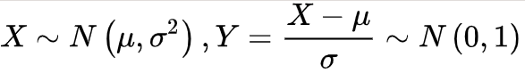
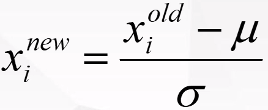
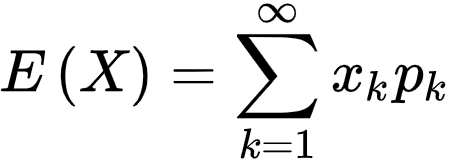
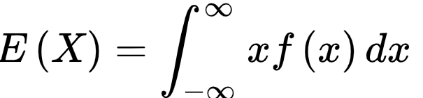
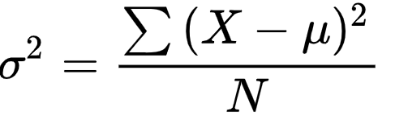
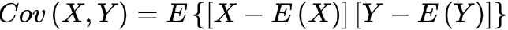
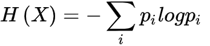

# Note2

# 一、数学

## 1、高等数学

### （1）导数的意义

导数，就是梯度下降的方向。设计模型的时候，整个模型需要可微。传统的算法是离散的，设计高精度的算法，和深度学习相结合，应该更多的考虑将传统算法变为可微的。

例如，检测碰撞。实时检测碰撞。轮廓由点云构成，传统检测为所有点互相计算距离。如果可以梯度下降法完成，但碰撞的损失不是可导的。

如果想要模型能够达到很好的效果，需要加入先验，但常常先验是离散的。

### （2）泰勒级数

**定义**：如果在点x=x0具有任意阶导数，则幂级数

称为在点x0处的泰勒级数。

这和激活函数的设计，还和网络模型的抽象能力有关。

神经网络后一层，相当于高阶导，神经网络的层数需要足够深，才能有足够的抽象能力，则是高阶导多，则更聪明。

例如：
$$
Swish = x · sigmoid(βx)
$$
是非饱和函数，有利于反向传播，同时sigmoid有无穷阶导数，表达能力更强。

使用swish相比relu可以使用更小的模型，达到相同的效果。

### （3）积分

积分和求和。

## 2、线性代数

### （1）范数

衡量张量的大小，就是用范数。
$$
||x||_{p}=(\sum_{i=1}^{N}|x_{i}|^p)^{\frac{1}{p}}
$$
零范数：向量中非零元素的个数

1范数：绝对值之和

2范数：向量的模

无穷范数：向量中的最大值

### （2）行列式

行列式 小于零为负定矩阵、零为奇异矩阵、大于零为正定矩阵。

标准矩阵的逆为他本身。

### （3）逆

矩阵的伪逆：
$$
(XX^T)^{-1}X^T
$$
最小二乘法：
$$
W =(XX^T)^{-1}X^TY
$$

### （4）相关性

相关性决定了模型能否训练出来。

例如一个线性方程有十个参数，但样本有十个则有唯一解，但是这十个样本需要不相关。

我们希望他，**独立同分布**。样本来自同一个分布，但又希望他是独立的，但不容易做到。

要想求解方程，则需要增加样本的数量。

神经网络就类似于相关性计算。相关性如何计算？就是计算内积，相当于全连接的一个神经元的运算。实际上相当于一个**路径选择**

此外，还希望神经网络提取的特征应该是不相关的，可以加损失，让他们的内积优化为零。

相关性和过拟合的关系。

参数少了，样本多了，有冲突，就欠拟合。

参数多了，样本少了，解不了方程就过拟合。

### （5）特征方程

## 3、概率论

### （1）经典概率

$$
P(x)
$$

### （2）条件概率

条件概率是指[事件](https://baike.baidu.com/item/事件/6129105)A**在事件B发生的条件下**发生的概率。条件[概率](https://baike.baidu.com/item/概率)表示为：P（A|B）

若只有两个事件A，B，那么，

**判别模型**，

### （3）联合概率

在概率论中，联合概率是指在多元的概率分布中多个随机变量分别满足各自条件的概率。

如果事件独立则：
$$
P(A,B) = P(A)P(B)
$$
**生成模型**

### （4）贝叶斯定理

$$
P(B_i|A)=\frac{P(B_i)P(A|B_i)}{\sum_{j=1}^{n}P(B_j)P(A|B_j)}
$$

公式中，事件Bi的概率为P(Bi)，事件Bi已发生条件下事件A的概率为P(A│Bi)，事件A发生条件下事件Bi的概率为P(Bi│A)。

### （5）分布

**零一分布**（伯努利分布）

二项分布

**均匀分布**

**中心极限定理**：在自然界与生产中，一些现象受到许多相互独立的随机因素的影响，如果每个因素所产生的影响都很微小时，总的影响可以看作是服从正态分布的

**高斯分布**：

标准化：

初始化参数的时候，什么方法比较好？：

1. 权重在一个范围内，
2. 尽量和原来的分布相同。
3. 得到的结果和标签的标准差减小。

### （6）期望

试验中每次可能结果的概率乘以其结果的总和

衡量数据的中心点。大数定理，概率论中讨论[随机变量](https://baike.baidu.com/item/随机变量/828980)[序列](https://baike.baidu.com/item/序列/1302588)的[算术平均值](https://baike.baidu.com/item/算术平均值/104868)向[随机变量](https://baike.baidu.com/item/随机变量)各数学期望的[算术平均值](https://baike.baidu.com/item/算术平均值)收敛的定律。

### （7）方差

表现数据的离散程度

偏差为预测数据的中心到真实期望的差距。

数据不全，容易产生较大的偏差，所以要让数据种类尽可能的多。而数据。

### （8）协方差

衡量两个变量的总体误差。描述特征与特征的相关性。

### （9）极大似然法

在参数θ的可能取值范围内，选取使L(θ)达到最大的参数值θ，作为参数θ的估计值。利用已知的样本结果，反推最有可能（最大概率）导致这样结果的参数值。

交叉熵和平方差，在高斯分布下是等价的。

交叉熵必须有概率的限制。

## 4、信息论

**熵**：熵的本质是一个系统“内在的混乱程度”

**信息**，描述不确定性
$$
I(x) = -log（p(x) ）
$$

**信息的熵**，就是信息的期望

**条件熵**：

𝐻(X|Y)定义为在给定条件 𝑌 下，X 的条件概率分布的熵对 Y 的数学期望

**相对熵**：衡量两个分布之间的距离。两个随机分布相同时，它们的相对熵为零

**交叉熵**：用于度量两个概率分布间的差异性信息，衡量输出与标签的距离

# 二、机器学习

尼布斯条件，一个模型要鲁棒性好，在输入有微小变化时，输出的变化也应该是微小的。

## 1、回归

## （1）模型

- 普通线性回归
- 岭回归
- LASSO回归
- 弹性网络
- 核岭回归：
  1. 线性核
  2. 高斯核
  3. 多项式核
  4. sigmoid核

## （2）评估指标：

回归的评估指标：

- Mean absolute error平均绝对值误差
- Mean squared error平均均方误差
- Explained variance score可解释的方差得分
- R2得分

## 2、分类

- SVM支持向量机
- kNN原理

## 3、聚类

- Kmeans聚类、Kmeans++
- 密度聚类
- 层次聚类
- 谱聚类

能用密度的地方，就用谱聚类，效果更好

## 4、集成学习

多个模型投票

## 5、数据预处理

- 标准化：去均值、方差规模化
- MinMaxScaler
- MaxAbsScaler
- RobustScaler
- Normalization
- 二值化
- OneHotEncoder独热编码 
- 弥补缺失数据 

## 6、决策树和回归树

### （1）决策树

决策树学习算法： 

- 特征选择 

- 决策树生成 
- 决策树剪枝

根据熵来选择节点

可以根据不同的计算方式来构建决策树：

- 条件熵
- 信息增益
- 基尼指数

容易过拟合。剪枝控制层数，控制分支，防止过拟合

### （2）回归树 

# 三、OpenCV

1、变换

仿射变换：原理乘一个矩阵。缩放、旋转、平移、错切。

透视变换：

单映射变换：

颜色空间操作

直方图均衡化