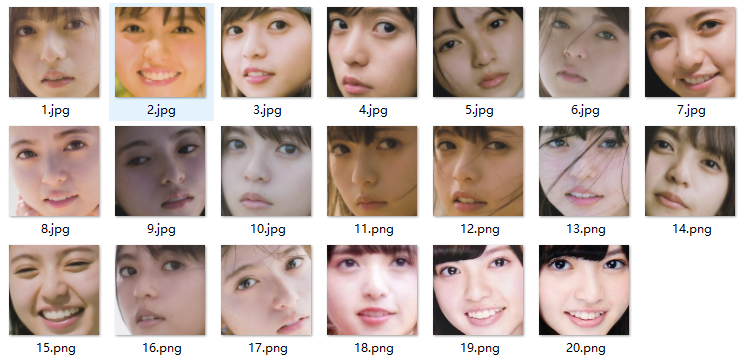
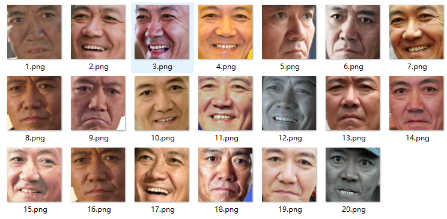

# Project 2

## 人脸识别

通过分类，训练一个特征提取器。

CenterLoss、Arc Face Loss将分类提取到的特征更加的聚合在一起。这样当添加新类的时候，就可以有充足的空间安放它，而不至于和其他已有类别混淆一起，达到能够分类不定数，待分类类别不曾出现在训练集的情况了。

## 1、模型

```python
class Net(nn.Module):

    def __init__(self):
        super(Net, self).__init__()
        self.net = densenet121(True)
        self.net.classifier = nn.Linear(1024, 1000, False)

    def forward(self, input_):
        return self.net(input_)
```

网络模型使用迁移学习的densenet121。

arcFace如下

```python
class ArcFace(nn.Module):

    def __init__(self, num_features, num_categories, angle=0.1, s=10.):
        super(ArcFace, self).__init__()
        self.num_features = num_features
        self.num_categories = num_categories
        self.angle = torch.tensor(angle)
        self.s = s
        self.w = nn.Parameter(torch.randn(self.num_features, self.num_categories))

    def forward(self, feature):
        feature = nn.functional.normalize(feature, dim=1)
        w = nn.functional.normalize(self.w, dim=0)
        cos_theta = torch.matmul(feature, w) / self.s
        theta = torch.acos(cos_theta)
        _top = torch.exp(self.s * torch.cos(theta))
        top = torch.exp(self.s * (torch.cos(theta + self.angle)))
        under = torch.sum(torch.exp(cos_theta * self.s), dim=1, keepdim=True)
        return top / (under - _top + top)
```

损失函数使用交叉熵

```python
self.loss_function = torch.nn.CrossEntropyLoss().to(self.devise)
```

## 2、数据集

起初，自己扣下人脸





一共扣取了6个人，每个人20张，共计120张。通过训练后，

在20个人，356次对比中，

其中，相同人照片匹配成功，阈值在0.85以上，不同人脸在相似度在0.85以下的情况有35次，即0.1的匹配成功率。

平均相同照片相似度为0.42

不同照片的相似度为0.33


在实际的摄像头匹配中，对于相同人脸的匹配度通常会达到0.95以上。

而不同人人脸的相似度会较低，但会在某些角度余弦相似度上升至0.9以上。


再更换为亚洲五百人的数据训练后，模型的对相同人脸的余弦相似度降低了，不同人脸亦降低。但是对相同人脸的对比成功度下降了。

## 3、结果

又更换为CASIAWebFaceData数据后，从中选取6000人训练。


初步行，不在数据库中的，无法匹配上，而注册了的能够匹配。

