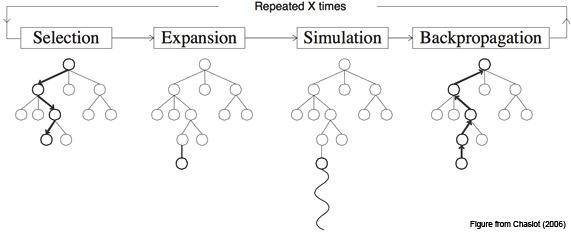

# Project 3

# YOLO_V3（You only look once）

集目标侦测框架之集大成者。

## 1、R-CNN

三种不同大小的候选框的卷积网络，进行卷积运算。


**核心思想：**

- 选择性搜索选出推荐区域，在自下而上的区域推荐上使用CNN提取特征向量
- 分别训练三个模型：CNN fine-tuning模型（提取图像特征，AlexNet训练ImageNet）、SVM分类器（预测类别）、回归模型（修正边界，L2损失）
- 提出了数据缺乏时训练大型CNNs的“辅助数据集有监督预训练—小数据集特定领域调优”训练方法。

**缺点：**

- **重叠区域特征重复计算，GPU还要40s**；
- 输入CNN的区域推荐图片有缩放会造成物体形变、信息丢失，导致性能下降。
- 分别训练三个模型，繁琐复杂：因为用的是传统目标检测的框架，需要训练CNN fine-tuning模型（提取图像特征）、SVM分类器（预测类别）、回归模型（修正边界），中间数据还需要单独保存。训练SVM时需要单独生成样本，而这个样本和CNN提取带出来的样本可能存在差异，将各个模型拼在一起就会有性能损失。
- 候选框选择搜索算法还是耗时严重，2000个候选框都需要CNN单独提取特征，计算量很大；
- 多个候选区域对应的图像需要预先提取，占用较大的磁盘空间；


## 2、Fast RCNN



依旧三种框框目标，并且以全连接网络，softmax分类，线形层回归。用卷积神经网络拿到特征图，再在特征图上做侦测。

相比RCNN，三个网络提取特征变为了，一个网络提取特征，然后在特征图上侦测。

然而有三个网络在侦测，依旧慢。


## 3、Faster RCNN


将特征图放入网络中，选择筛选使用那些框，框选目标。再拿筛选出的框，进行侦测。


## 4、空间金字塔池化


全连接对输入有形状限制。

如果希望，金字塔的某一层输出nXn个特征，那么你就要用windows size大小为：(w/n,h/n)进行池化了。即自适应池化。

在特征图上，以不同的核大小进行自适应池化。


## 5、[YOLO](https://blog.csdn.net/qq_37541097/article/details/81214953)


YOLO类似于fast rcnn解构，通过一个主网络，53层的暗黑网络（DarkNet），提取特征。输出13X13、26x26、52x52的特征图，使用一个5层的网络（Convolutional Set卷积集)分别在其上侦测大、中、小尺度的目标。

并且，侦测的26x26和52x52的特征图，来源于网络不通层级的输出和13X13的特征图上采样后的concatenate。如此，即保证了特征的抽象化，又保证了信息的丰富程度。


在不同的尺度的输出，又拥有三种不同候选框的。同时目标的信息同MTCNN一样，放置于通道上。

### （1）目标边界框的预测

YOLOv3网络在三个特征图中分别通过(4+1+c)xk个大小为11的卷积核进行卷积预测，k为预设边界框（bounding box prior）的个数（k默认取3），c为预测目标的类别数，其中4k个参数负责预测目标边界框的偏移量，k个参数负责预测目标边界框内包含目标的概率，ck个参数负责预测这k个预设边界框对应c个目标类别的概率。


图中虚线矩形框为预设边界框，实线矩形框为通过网络预测的偏移量计算得到的预测边界框。

其中$(c_{x},c_{y})$为预设边界框在特征图上的中心坐标，$(p_{w},p_{h})$为预测边界框在特征图上的宽和高，$(t_{x},t_{y},t_{w},t_{h})$分别为网络预测的边界框中心偏移量$(t_{x},t_{y})$以及宽高缩放比$(t_{w},t_{h})$，$(b_{x},b_{y},b_{w},b_{h})$为最终预测的目标边界框，$\sigma(x)$函数为sigmoid函数，将预测偏移量缩放为0~1之间，这样能够将预设边界框的中心坐标固定在一个cell当中，这样能够加快网络收敛


### （2）YOLONet(DarkNet53)

编写网络层。[P3YOLO_V3.py](project3/P3YOLO_V3.py)

首先，卷积层大量复用，其包括了包含了’卷积‘、‘BatchNorm批归一化’、‘LeakyReLU激活函数’

```python
class ConvolutionLayer(nn.Module):
```

接着，是通过步长为2的下采样卷积层多次使用：

```python
class DownSampling(nn.Module):
```

然后，就是残差块。首先使用1x1卷积压缩通道，再通过3x3的卷积将通道还原，形成瓶颈解构，并做残差。

```python
class ResidualBlock(nn.Module):
```

然后就是对特征图的一个侦测网络，共五层，分别使用三次。

```python
class ConvolutionSet(nn.Module):
```

对26x26和52x52的特征图的侦测，因为经由DarkNet提取至13x13时，特征抽象程度高，但信息量不足，需要和网络中间层输出做连接，故需要上采样至相同形状。

```python
class UpSimpling(nn.Module):

    def __init__(self):
        super(UpSimpling, self).__init__()

    def forward(self, input_):
        return nn.functional.interpolate(input_, scale_factor=2, mode='nearest')
```

最后则是主网络。

```python
class YOLOVision3Net(nn.Module):
    """
    YOlO v3的网络。使用的为暗黑网络53层（DarkNet53）的网络。

    参数：
        out_channels：输出通道数。此数字为(4+1+c)*k；
        k为有多少的检测框,一般为3；c为检测的类别数；4为边框回归（中心点，长宽）；1为是否有目标的置信度。
    """
    def __init__(self, out_channels):
        super(YOLOVision3Net, self).__init__()
        self.out_channels = out_channels
        '''实例化，暗黑网络的1~26层'''
        self.feature_map52x52 = nn.Sequential(
            '''......'''
        )
        
        '''实例化，暗黑网络的27~43层'''
        self.feature_map26x26 = nn.Sequential(
            '''......'''
        )

        '''实例化，暗黑网络的44~52层'''
        self.feature_map13x13 = nn.Sequential(
            '''......'''
        )

        '''实例化，检测13x13尺度的卷积集（ConvolutionSet）'''
        self.con_set13x13 = ConvolutionSet(1024, 512)

        '''实例化，大尺度目标的输出网络层'''
        self.predict1 = nn.Sequential(
            '''......'''
        )

        '''实例化，13x13变换至26x26的上采样，网络层'''
        self.up_to_26x26 = nn.Sequential(
            '''......'''
        )

        '''实例化，检测26x26尺度的卷积集（ConvolutionSet）'''
        self.con_set26x26 = ConvolutionSet(768, 256)

        '''实例化，中尺度目标的输出网络层'''
        self.predict2 = nn.Sequential(
            '''......'''
        )

        '''实例化，26x26变换至52x52的上采样，网络层'''
        self.up_to_52x52 = nn.Sequential(
            '''......'''
        )

        '''实例化，检测52x52尺度的卷积集（ConvolutionSet）'''
        self.con_set52x52 = ConvolutionSet(384, 128)

        '''实例化，小尺度目标的输出网络层'''
        self.predict3 = nn.Sequential(
            '''......'''
        )

    def forward(self, input_):

        """获得52x52的特征图"""
        feature_map52x52 = self.feature_map52x52(input_)

        '''获得26x26的特征图'''
        feature_map26x26 = self.feature_map26x26(feature_map52x52)

        '''获得13x13的特征图'''
        feature_map13x13 = self.feature_map13x13(feature_map26x26)

        '''侦测13x13的特征图，并输出结果'''
        con_set_13 = self.con_set13x13(feature_map13x13)
        predict1 = self.predict1(con_set_13)

        '''上采样至26x26，并与暗黑网络输出的26x26的特征图做concatenate'''
        up_26 = self.up_to_26x26(con_set_13)
        concatenated26x26 = torch.cat((up_26, feature_map26x26), dim=1)

        '''侦测26x26的特征图，并通过输出层输出结果'''
        con_set_26 = self.con_set26x26(concatenated26x26)
        predict2 = self.predict2(con_set_26)

        '''上采样至52x52，并与暗黑网络输出的52x52的特征图做concatenate'''
        up_52 = self.up_to_52x52(con_set_26)
        concatenated52x52 = torch.cat((up_52, feature_map52x52), dim=1)

        '''侦测52x52的特征图，并通过输出层输出结果'''
        con_set_52 = self.con_set52x52(concatenated52x52)
        predict3 = self.predict3(con_set_52)
        return predict1, predict2, predict3
```


### （3）数据制作

使用精灵标注手，在包含需要侦测的目标的图片上，标注为：


将导出的文件，程序解析为文本格式。

### （4）xml文档解析

导入cElementTree模块

```python
from xml.etree import cElementTree as ET
```

打开该文件，进行解析

```python
tree = ET.parse(file)
```

读取该文件包含的文件名

```python
name = tree.findtext('filename')
```

循环迭代里面的子项目

```python
for obj in tree.iter('object')
```

再从子项目里，读取数据：

```python
x1 = obj.findtext('bndbox/xmin')
y1 = obj.findtext('bndbox/ymin')
x2 = obj.findtext('bndbox/xmax')
y2 = obj.findtext('bndbox/ymax')
```

### （5）图片处理

将图片缩放为416X416的大小，等比缩放，短边部分用黑框代替。

对应坐标换算为处理后的图片上的坐标。


### （6）筛选候选框

将变换后的，处理出来的坐标，提取出每一个目标框的长宽，进行kmean算法，聚类得到9种框。

以交并比来判断距离：
$$
dist = 1-IOU
$$
依次为依据，进行优化[P3Kmeans.py](project3/P3Kmeans.py)

```python
for row in range(rows):
    distances[row] = 1 - iou(boxes[row], big_brothers)
```

聚类步骤：

1. 首先输入k的值，即我们希望将数据集经过聚类得到k个分组。
2.  从数据集中随机选择k个数据点作为初始老大哥（质心，Centroid）
3. 对集合中每一个小弟，计算与每一个老大哥的距离（距离的含义后面会讲），离哪个老大哥距离近，就跟定哪个老大哥。
4.  这时每一个老大哥手下都聚集了一票小弟，这时候召开人民代表大会，每一群选出新的老大哥（其实是通过算法选出新的质心）。

5.  如果新大哥和老大哥之间的距离小于某一个设置的阈值（表示重新计算的质心的位置变化不大，趋于稳定，或者说收敛），可以认为我们进行的聚类已经达到期望的结果，算法终止。
6. 如果新大哥和老大哥距离变化很大，需要迭代3~5步骤。

筛选出：

```python
boxes_base = {
    52: ((29, 40), (15, 17), (65, 55)),
    26: ((49, 105), (88, 176), (123, 99)),
    13: ((311, 277), (158, 238), (262, 144))
```


### （7）训练模型

训练置信度，使用二值交叉熵损失

训练边框回归，使用均方差损失

训练分类，使用交叉熵。

标签做为**（N, H, W, 3, 6）**

—3为每种尺度中的3中不同形状的框，

—6包括，置信度，中心点X和Y，长宽缩放比P_w和P_y，分类

做损失时，首先需将预测结果变换形状为**（N, H, W, 3, (4+1+c) k）**

```python
    def compute_loss(self, predict, target):

        """标签形状为（N,H,W,3,6）"""
        n, c, h, w = predict.shape
        predict.permute(0, 2, 3, 1)
        predict = predict.reshape(n, h, w, 3, -1)
```

得到标签中置信度为1的掩码和负样本掩码：

```python
mask_positive = target[:, :, :, :, 0] > 0
mask_negative = target[:, :, :, :, 0] = 0
'''索引出标签的正负样本'''
target_positive = target[mask_positive]
target_negative = target[mask_negative]
'''索引出预测值的正负样本'''
predict_positive = predict[mask_positive]
predict_negative = predict[mask_negative]
```

同时，因为同一幅图，不是所有尺度都存在目标的，故需判断，并排除掉不存在目标的正样本，否则索引不出值，损失返回是Nan。

```python
number, _ = target_positive.shape
if number>0:
	loss_c_p = self.binary_cross_entropy(self.sigmoid(predict_positive[:, 0]), target_positive[:, 0])
else:
	loss_c_p = 0
```

同时，因为还得训练非目标的能力，索引，仅将正样本的损失置零即可。


因为训练图片尺度大，4G显存的显卡训练，每次仅仅能放入**3张图片**。


### （8）模型使用

模型使用，同训练时，几乎一致。

同样将预测结果，先换轴，再尺寸变换，通过阈值筛选，然后反算回原图：

再进行带类别的非极大值抑制即刻。

[P3Explorer.py](project3/P3Explorer)

