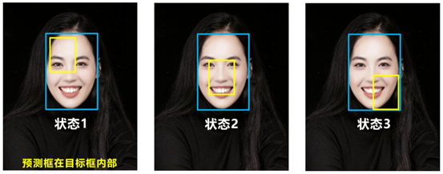

# Project4

# YOLOv4、YOLOv5


# 1、YOLO_v4结构


**Yolov4**的五个基本组件：

1. **CBM**：Yolov4网络结构中的最小组件，由Conv+Bn+Mish激活函数三者组成。
2. **CBL**：由Conv+Bn+Leaky_relu激活函数三者组成。
3. **Res unit**：借鉴Resnet网络中的残差结构，让网络可以构建的更深。
4. **CSPX**：借鉴CSPNet网络结构，由卷积层和X个Res unint模块Concate组成。
5. **SPP**：采用1×1，5×5，9×9，13×13的最大池化的方式，进行多尺度融合。

**其他基础操作：**

1. **Concat**：张量拼接，维度会扩充，和Yolov3中的解释一样，对应于cfg文件中的route操作。
2. **add**：张量相加，不会扩充维度，对应于cfg文件中的shortcut操作。


# 2、YOLOV3和YOLOV4的PAN


原本的PANet网络的**PAN**结构中，两个特征图结合是采用**shortcut**操作，而Yolov4中则采用**concat**（**route**）操作，特征图融合后的尺寸发生了变化。


# 3、Swish激活函数


$$
f(x) = x · sigmoid(βx)
$$
由泰勒展开式，如此可拥有无穷皆导数，sigmoid中的$e^{-x}$可提供比relu更高的表达能力。同时保留了relu的学习快的特性。


# 4、mish激活函数


$$
Mish = x*tanh(ln(1+e^x))
$$


从图中可以看出他在负值的时候并不是完全截断

而是允许比较小的负梯度流入

从而保证信息流动，并且激活函数无边界这个特点，让他避免了饱和这一问题

比如sigmoid，tanh激活函数通常存在梯度饱和问题，在两边极限情况下，梯度趋近于0

而Mish激活函数则巧妙的避开了这一点

另外Mish函数也保证了每一点的平滑，从而使得梯度下降效果比Relu要好


# 5、L1、L2、SMOOTH_L1


## （1）均方误差、平方损失

L2损失，就是均方差损失。
$$
MSE =\frac{\sum_{i=1}^{n}(y_i - y_i^{t})^2}{n}
$$
优点：各点都连续光滑，方便求导，具有较为稳定的解

缺点：不是特别的稳健，为什么？因为当函数的输入值距离中心值较远的时候，使用梯度下降法求解的时候梯度很大，可能导致**梯度爆炸**。


## （2）平均绝对误差

L1损失，平均绝对误差（MAE）是另一种常用的回归损失函数，它是目标值与预测值之差绝对值的和，表示了预测值的平均误差幅度，而不需要考虑误差的方向，范围是0到∞，其公式如下所示：
$$
MSE =\frac{\sum_{i=1}^{n}|y_i - y_i^{t}|}{n}
$$


## （3）L1、L2范数损失

L1范数损失函数，也被称为最小绝对值偏差（LAD），最小绝对值误差（LAE）。总的说来，它是把目标值（Yi)与估计值（f(xi))的绝对差值的总和（S)最小化：


L2范数损失函数，也被称为最小平方误差（LSE）。总的来说，它是把目标值（Yi)与估计值（f(xi))的差值的平方和（S)最小化：


L1范数与L2范数作为损失函数的区别能快速地总结如下：


## （4）smooth L1损失函数

其实顾名思义，smooth L1说的是光滑之后的L1，前面说过了L1损失的缺点就是有折点，不光滑，导致不稳定，那如何让其变得光滑呢？smooth L1损失函数为：
$$
SmoothL1(x) = \left\{\begin{matrix}0.5x^2 & |x|<1
\\ 
|x|-0.5 & |x|\geq 1
\end{matrix}\right.
$$
smooth L1损失函数曲线如下图所示，作者这样设置的目的是想让loss对于离群点更加鲁棒，相比于L2损失函数，其对离群点（指的是距离中心较远的点）、异常值（outlier）不敏感，可控制梯度的量级使训练时不容易跑飞。


# 6、IOU_LOSS

## （1）IOU


可以看到IOU的loss其实很简单，主要是**交集/并集**，但其实也存在两个问题。


**问题1**：即状态1的情况，当预测框和目标框不相交时，IOU=0，无法反映两个框距离的远近，此时损失函数不可导，IOU_Loss无法优化两个框不相交的情况。

**问题2**：即状态2和状态3的情况，当两个预测框大小相同，两个IOU也相同，IOU_Loss无法区分两者相交情况的不同。

因此**2019**年出现了GIOU_Loss来进行改进。

## （2）GIOU


$$
GIOU\_Loss = 1-GIOU = 1-(IOU-\frac{差集}{最小外接矩形})
$$
可以看到右图GIOU_Loss中，增加了相交尺度的衡量方式，缓解了单纯IOU_Loss时的尴尬。

但是还存在一种**不足**：



**问题**：状态1、2、3都是预测框在目标框内部且预测框大小一致的情况，这时预测框和目标框的差集都是相同的，因此这三种状态的**GIOU**值也都是相同的，这时GIOU退化成了IOU，无法区分相对位置关系。
基于这个问题，**2020**年的AAAI又提出了**DIOU_Loss**。


## （3）DIOU

好的目标框回归函数应该考虑三个重要几何因素：**重叠面积、中心点距离，长宽比。**

针对IOU和GIOU存在的问题，作者从两个方面进行考虑

**一：如何最小化预测框和目标框之间的归一化距离？**

**二：如何在预测框和目标框重叠时，回归的更准确？**

针对第一个问题，提出了DIOU_Loss（Distance_IOU_Loss）


DIOU_Loss考虑了**重叠面积**和**中心点距离**，当目标框包裹预测框的时候，直接度量2个框的距离，因此DIOU_Loss收敛的更快。


但就像前面好的目标框回归函数所说的，没有考虑到长宽比。

比如上面三种情况，目标框包裹预测框，本来DIOU_Loss可以起作用。

但预测框的中心点的位置都是一样的，因此按照DIOU_Loss的计算公式，三者的值都是相同的。

针对这个问题，又提出了CIOU_Loss。


## （4）CIOU

CIOU_Loss和DIOU_Loss前面的公式都是一样的，不过在此

基础上还增加了一个影响因子，将预测框和目标框的长宽比都考虑了进去。其中v是衡量长宽比一致性的参数，我们也可以定义为：
$$
CIOU\_Loss = 1-CIOU = 1-(IOU-\frac{Distance\_2^2}{Distance\_C^2}-\frac{V^2}{(1-IOU)+V})
$$

$$
V = \frac{4}{\pi^2 }(arctan\frac{w^{gt}}{h^{gt}}-arctan\frac{w^{p}}{h^{p}})^2
$$

这样CIOU_Loss就将目标框回归函数应该考虑三个重要几何因素：重叠面积、中心点距离，长宽比全都考虑进去了。

再来综合的看下各个Loss函数的不同点：

**IOU_Loss**：主要考虑检测框和目标框重叠面积。

**GIOU_Loss**：在IOU的基础上，解决边界框不重合时的问题。

**DIOU_Loss**：在IOU和GIOU的基础上，考虑边界框中心点距离的信息。

**CIOU_Loss**：在DIOU的基础上，考虑边界框宽高比的尺度信息。


（5）DIOU_nms

训练使用CIOU、而使用时使用DIOU筛选框。


# 7、训练

加先验。比如迁移学习，会快一些，且精度会提升。

可以先在IMage数据集进行分类训练，再训练其他的任务。


## （1）cutout、random erase

随机隐去数据的一部分，是为了凸显目标。


## （2）Grid Mask

掩码隐去一部分数据。图片等分后，间隔地去除数据。


## （3）Hide and Seek

将加小切的地方，放大。


## （4）Mosaic数据增强方法

将4张不同图片镶嵌到一张图片中：


优点：

- 混合四张具有不同语义信息的图片，可以让检测器检测超出常规语境的目标，增强模型的鲁棒性。
- 由于BN是从四张图片计算得到的，所以可以减少对大的mini-batch的依赖。


## （5）DropBlock


（6）下采样

```python
class Focus(nn.Module):
    # Focus wh information into c-space
    def __init__(self, c1, c2, k=1, s=1, p=None, g=1, act=True):  # ch_in, ch_out, kernel, stride, padding, groups
        super(Focus, self).__init__()
        self.conv = Conv(c1 * 4, c2, k, s, p, g, act)

    def forward(self, x):  # x(b,c,w,h) -> y(b,4c,w/2,h/2)
        return self.conv(torch.cat([x[..., ::2, ::2], x[..., 1::2, ::2], x[..., ::2, 1::2], x[..., 1::2, 1::2]], 1))
```

下采样的时候，x(b,c,w,h) -> y(b,4c,w/2,h/2)，间隔则跌在一起下采样。在减小计算量的同时，保证信息没有丢失。


# 8、可视化模型

使用netron模块

pip install netron安装

在命令行中输入netron

out：

```python
Serving at http://localhost:8080
```

打开模型，即可查看可视化模型情况