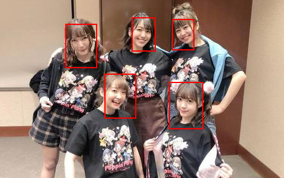

# MTCNN总结

## 1、实现原理

为了实现多目标的识别，巧妙地使用卷积的在图片上扫描的一个特性，模拟人自身在图片上寻找目标的一个动作。第一个P网络，控制其感受野为12，步长为2。即达成了一个12X12的窗口，能够以两个像素的步长，在图片上扫视。同时为了解决窗口小，而目标大小不定，但网络却不能改变的情况，将图片做图像金字塔，即缩小图片。缩小的倍数按照$\frac{\sqrt{2}}{2}$的倍数缩小，直到缩小的图片的最小边长小于12，即网络已无法对其做卷积的状态。之所以选择0.707作为缩小倍数，因为如果选择0.5的话，缩小后的图的面积就变为原来的$\frac{1}{4}$缩放得太过，而0.707倍数缩放后，恰巧面积为原来的0.5，刚刚好。如果进一步增大缩小比例，那么图片会太多，严重影响P网络的工作性能。

同时，为了解决识别多个目标，输出需要不定的情况。网络舍弃掉全连接层。根据卷积的输入图片长宽不定，输出的长宽不定，但通道数相同的特点。以通道维度的数据，来表示单个目标的侦测信息（置信度，x1,y1,x2,y2）,输出特征图的长宽维度的信息，则为每一个扫描框侦测目标的。

则P网络结构如下：

```python
from torch import nn
class PNet(nn.Module):

    def __init__(self):
        super(PNet, self).__init__()
        self.conv1 = nn.Sequential(
            nn.Conv2d(in_channels=3, out_channels=10, kernel_size=3, stride=1, padding=0),
            nn.MaxPool2d(kernel_size=2, stride=2),
            nn.PReLU(),

            nn.Conv2d(10, 16, 3, 1),
            nn.PReLU(),
            nn.Conv2d(16, 32, 3, 1),
            nn.PReLU()
        )
        self.classification = nn.Sequential(
            nn.Conv2d(32, 1, 1),
            nn.Sigmoid()
        )
        self.regression = nn.Conv2d(32, 4, 1)
```

在图片经过图像金字塔，由P网络输出结果后，通过置信度过滤后，需要反算回原图对应的区域。

计算公式为：
$$
(x1,y1)=(x',y')\times Stride\div zoom\_ratio
$$

$$
(x2,y2)=[(x',y')\times Stride + kernelsize-1]\div zoom\_ratio
$$

(x1,y1)对应候选框左上角于原图的位置

(x2,y2)对应候选框右下角于原图的位置

(x',y')为特征图上的一个值的位置

kernelsize为该网络感受野的大小。

Stride为扫描时的步长。

zoom\_ratio为图片相较于原图的缩放比

然后计算候选框的位置：
$$
side\_len = kernelsize \div  zoom\_ratio
$$

$$
(\mathbf{X},\mathbf{Y}) = (x,y) + (x'',y'') * side\_len
$$

side\_len为当前区域对应于原图的边长

(x'',y'')为网络输出的偏移量。

(x,y)为反算回原图的区域

$(\mathbf{X},\mathbf{Y})$为在原图上实际框的位置。

计时通过置信度阈值筛选后，依然具有大量的重复的候选框，这些候选框都指向同一个目标。此时就需要进行非极大值抑制抑制，消除多余的框，找到最佳的目标检测位置。

具体的实现步骤如下：

1. 根据置信度降序排列候选框列表
2. 选取置信度最高的框A添加到输出列表，并将其从候选框列表中删除
3. 计算A与候选框列表中的所有框的**IoU**值，删除大于阈值的候选框
4. 重复上述过程，直到候选框列表为空，返回输出列表

然后根据这些候选框，从原图上截取，输入r网络识别。p网络输出的框是长宽是不同的，因此经过拓展，为正方形后，再截取，并缩放为24x24后再传入r网络。r网络因为输入的图片都是一样的。所以可以接上全连接层，并且可以按照批次输入。

然后按照实际抠图位置，反算回原图的区域上。
$$
(\mathbf{X},\mathbf{Y}) = (x,y) + (x'',y'') * side\_len
$$
(x,y)为抠图区域的坐标，

(x'',y'')为网络输出的偏移量，

side\_len为抠图区域的边长。

同样经过非极大值抑制之后，并抠图，传入O网络，经过最后的识别，反算。进行非极大值抑制，这里的非极大值抑制计算交并比（IOU）的时候，需除以最小面积，以排除大框套小框的情况。即完成整个识别过程。

## 2、训练过程

通过将标注有人脸的数据，制作训练样本。因即需要训练置信度，又需要训练回归。故需要有正负样本，即有人脸和无人脸。同时，为了训练识别人脸位置的能力，需要人脸随机处于任意位置。则部分人脸，与人脸。

则，截取出来的图片与标签人脸框的交并比

0~0.3，为非人脸

0.65~1.00，为人脸

0.4~0.65,为部分人脸

0.3~0.65，部分舍弃不用，地标

训练样本比例，负样本：正样本：部分正样本：地标=3:1:1:2

并将截取的图片相应缩放为12x12、24x24、48x48规格的图片，并计算标记在所截取图片的相对位置。

将制作好的数据，进行网络训练即可。

## 3、结果

测试数张图片：




识别结果较好。

然而，此时检测一张图片需要花费大约0.749秒

此时的模型，所有运算都是在cpu上进行的，故速度较慢。

同时，发现，在初始时，给P网络做的训练样本的正、负、部分比例为：1:1:1时；和3:1:1时。在相同的置信度下，前者的候选框为后者的3倍。即提高了负样本比例，可大大减少正样本的误报率，同时又些许提升了漏检的可能。

## 4、优化

将模型放置于cuda上运算。

```python
self.device = torch.device("cuda:0" if torch.cuda.is_available() and is_cuda else "cpu")
```

```python
p_net = p_net.to(self.device)
r_net = r_net.to(self.device)
o_net = o_net.to(self.device)
```

此时同一张图片提速至0. 421秒。此时，所有运算都是使用tensor进行，而且NMS也是在cuda上进行。

经过测试，同样的三条数据框，

在使用numpy写的非极大值抑制上，平均用时0.00012192487716674804秒

在使用torch写的非极大值抑制上，用时0.0008304879665374756秒，相较于numpy，慢了近八倍。

此外，在cuda上进行非极大值抑制，用时会比不在cuda上消耗更多的时间，达到了0.0073854453563690185秒。

故，除模型以外的所有运算皆采用numpy进行。

经过优化，360X640的图片需要时间为0.069秒左右。

