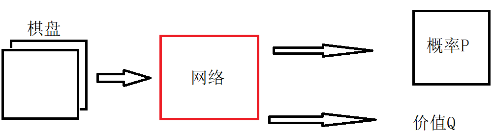
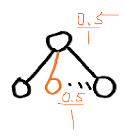
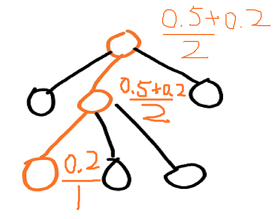
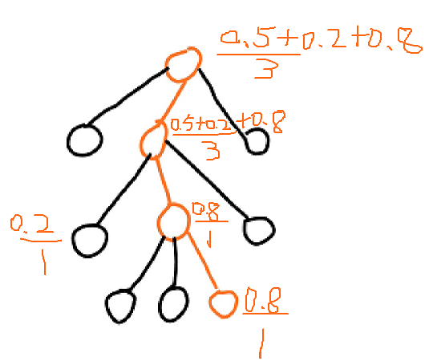
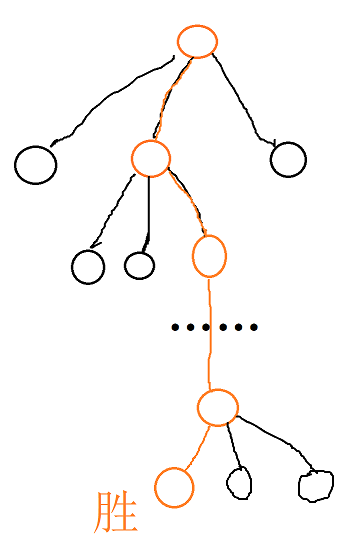

# 深入浅出Alpha Zero技术原理

# 1、蒙特卡洛树搜索

## （1）蒙特卡洛方法

蒙特卡罗法也称统法模拟法、统计试验法。是把概率现象作为研究对象的数值模拟方法。

上图中，求中间曲线区域的面积。曲线区域的面积不易计算，而正方形面积易于计算。则可以进行随机地采样，将属于曲线内的点的数量记作$N_{a}$，一共采样了N次。

则中间曲线区域的面积为：
$$
S=S_{square} \frac{N_{a}}{N}
$$
$S$ -曲线区域面积

$S_{square}$ -正方形的面积

于是通过随机采样的方式计算出了曲线区域的面积，采样的次数越多，则越精确。

## （2）博弈树和剪枝

大多数的博弈，可以当做一棵树。在树上找路径。围棋有3^（19x19）的可能，有些路径是死路，需要修剪掉。神经网络有记忆能力，由神经网络做剪枝，将需要的部分记忆下来。

## （3）蒙特卡洛树

上图展示的是蒙特卡洛树的建立过程，选择路径、扩张、模拟、反向传播。

下面详细讲解蒙特卡洛树建立的过程。

首先开始一局围棋。此时的棋盘上没有一颗棋子，我们先建立一个节点。

此时该节点属于[叶子节点](https://baike.baidu.com/item/%E5%8F%B6%E5%AD%90%E7%BB%93%E7%82%B9/3620239?fr=aladdin)。并且是蒙特卡洛树的初始状态。

于是我们需要扩展该节点。

也就是说，此时围棋中，是执黑手的一方下棋。现在我们看棋盘，有19X19个位子可供选择，于是可以拓展出361个子节点。见下图所示：

然后我们随机地选这一步棋，并走出这一步棋。比如下图所示这一步棋子：

然后我们就开始模拟这一步棋将会带来的结果。便是随机下棋，直到棋局终止，计算结果。

假定模拟下棋至终点的结果为胜。那么我们统计进入导致该结果所经过的节点。见下图：

其中，上式中，分子代表获胜的次数，分母代表途经该节点的次数。

于是我们开始玩第二把围棋。我们从空棋盘下，走出一步，依旧走第一次下棋的那步棋。

然后发现该节点是叶子节点，于是要拓展。于是发现有如下位置可以下子，见绿色部分。

现在我们随机的选择一步棋下下去：

之后，我们模拟该步棋子的结果，随机地下至局终：

发现该棋局为败，于是我们更新抵达这一结果的所有节点。

同样的，在每个节点，分子代表获胜的次数，分母代表途经该节点的次数。

然后，再一次开始玩游戏。

下出如此的棋，并在走至节点A后，发现该节点是叶子节点，于是拓展一下，建立出绿色的可行棋的子节点。

然后选择一步棋，并下出来。之后随机地下至局终，得到该结果。

于是更新出抵达这一结果的路经的所有节点：

我们可以看到，如果持续这样的过程，只要经过很多很多步，则可以建立一个庞大的树结构，称之为**蒙特卡洛树**。每一个节点的比例，则代表的是该节点的胜率。只要建立这样的一棵树以后，在实际下棋的过程中，按照每一个节点的胜率，选择最大的一个即可。

# 2、带神经网络的蒙特卡洛树

然而这样的一个蒙特卡洛树并不容易建立，因为围棋中的最大变化次数为10^172种，即使部分的棋局不可能出现局面，也将是庞大的。以现在算力，计算至宇宙灭亡也是不可能完全建立这样的一棵蒙特卡洛树。其中最花费计算力的是，模拟过程，因为每下一次棋，都要模拟下棋至局终。

## （1）选择策略

于是，我们建立一个神经网络，使用神经网络来给出该节点的胜负。并使用神经网络来选择节点，而非完全是随机选择节点。

在每一次选择节点的时候，选择$Q(s,a)+U(s,a)$最大的一个动作：
$$
U(s,a)=c_{puct}P(s,a)\frac{\sqrt{\sum_{b}N(s,b)}}{1+N(s,a)}
$$

—$P(s,a)$ ：网络输出的先验概率

—$\sum_{b}N(s,b)$ ： 父节点访问次数

—$N(s,a)$ :  该节点访问次数

—$c_{puct}$ : 探索系数

—Q(s,a) ： 该节点的价值

如此，在选择落子的时候，最开始会更加倾向于**高先验概率**（P）和**低访问次数**（N）的，但逐渐地会更加倾向于有着**更高价值**（Q）的地方落子。

##  （2）网络学习过程

神经网络输入的是棋盘的情况，输出的是当前棋局每一步的概率，以及获胜的概率。

在网络刚刚初始化的时候，传入棋局，输出的概率都是随机的。首先我们开始一盘下棋过程。

开始还是叶子节点，于是拓展出子节点，并依照$Q(s,a)+U(s,a)$选择出最大的一个节点，走出这一步棋：

此时，我们不再随机地下棋来得到最后输赢的结果，而是采用网络的方式，直接得到胜负。但网络得到的胜负一定是一个概率值。例如，在该节点，网络判断胜负的概率为0.5，则更新为：

接着，我们又再一次的下棋

同样由神经网络判断该节点的胜负。于是又更新为：

再一次模拟：

这样我们能够快速地建立蒙特卡洛树。

但是网络并不是训练好的，此时得到的价值、概率也好都是随机的。

所以，但像这样下棋达到一定次数后，所以需要真的下一盘直至中点的棋：

这样，就采集到了实际样本。

在每一个抵达该结果所途径的节点，都可以采集一条数据。格式为：
$$
(S_1,P_1,V_1)\\
(S_2,P_2,V_2)\\
(S_3,P_3,V_3)\\
……\\
(S_n,P_n,V_n)
$$
—S 为该节点的棋局，

—P 为  各个子节点获胜次数比该节点。

—V为价值

最后一步白旗取得胜利则：
$$
(S_1,P_1,-1)\\
(S_2,P_2,1)\\
(S_3,P_3,-1)\\
……\\
(S_n,P_n,1)
$$
这里之所以奇偶步的价值不相同，是由于，下围棋中是自我博弈，交替进行。在$S_1、S_3、S_{n-1}$时，是黑旗在行棋，即为失败的，价值为-1。而在$S_2、S_2、S_{n}$时，为白旗行棋，为获胜，则价值为1。

这样就采集到一组数据，提供给神经网络训练。

整体步骤为：

1. 使用不准的网络提供胜负，来建立一个不准确的蒙特卡洛树。
2. 网络下棋至一定的程度后，下一盘真的棋，获取真实样本。
3. 真实样本训练神经网络。
4. 训练了一次的神经网络变得比较靠谱，继续建立这个蒙特卡洛树，蒙特卡洛树则进一步变得准确。
5. 重复1~4步，直到满意为止。

如此循环往复，不断地让网网络构建树，并采集样本训练。

## （3）使用过程

神经网络提供先验，真正下棋是蒙特卡洛树。

每一次的下棋过程中，在当前状态下，会先向下探索若干步。并选择最大的$Q(s,a)+U(s,a)$的一步，来行棋。模拟了人下棋时想的过程。

